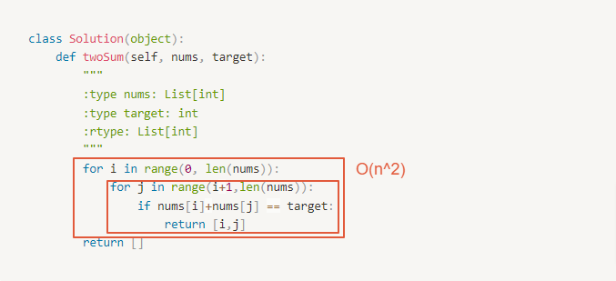

# 0001. Two Sum

Category: Array
Difficulty: easy
Link: https://leetcode.com/problems/two-sum/

# Clarification

1. Check the inputs and outputs
    - INPUT:
        - Array[int]
        - integer
    - OUTPUT:
        - Array[int]
2. Check the main goal
    - checkt the sum

# Naive Solution

<aside>
💡 從最簡單的方法開始 easy solution → only speak out

</aside>

### Thought Process

1. two for loop to check the sum
- Implement
    
    ```python
    class Solution(object):
        def twoSum(self, nums, target):
            """
            :type nums: List[int]
            :type target: int
            :rtype: List[int]
            """
            for i in range(0, len(nums)):
                for j in range(i+1,len(nums)):
                    if nums[i]+nums[j] == target:
                        return [i,j]
            return []
    ```
    

### Complexity

- Time complexity:
    - $O(n^2)$
    
    
    
- Space complexity:
    - $O(n)$

### Problems & Improvement

<aside>
💡 解釋該解法的問題、可以往哪個方向改善 (一次改善一個問題)

- 瓶頸點在哪裡
- 哪些部分是不需要的
</aside>

- too slow to enumerate the sum

# Improvement

### Thought Process

1. sort the array ( ⚠️ the index would be different )
    1. how could I sort the array and I still remember the index
        
        a map?
        
2. check the two summation from different side of the array
    1. if larger than the target ⇒ backward - 1
    2. if smaller than the targe ⇒ forward + 1
    3. the same ⇒ return the index
- Implement
    
    ```python
    class Solution(object):
        indexDict = {}
        def twoSum(self, nums, target):
            """
            :type nums: List[int]
            :type target: int
            :rtype: List[int]
            """
            self.mapArray(nums)
            nums.sort()
            i = 0
            j = len(nums) - 1
            while i!=j:
                tempSum = nums[i] + nums[j]
                if tempSum > target:
                    j = j-1
                elif tempSum < target:
                    i = i+1
                else:
                    return [self.getIndex(nums[i]),self.getIndex(nums[j])]
            return[]
        
        def mapArray(self, nums):
            for i in range(0, len(nums)):
                if nums[i] in self.indexDict:
                    self.indexDict[nums[i]].append(i)
                else:
                    self.indexDict[nums[i]] = [i]
            return
        
        def getIndex(self, key):
            return self.indexDict.get(key).pop()
    ```
    

### Complexity

- Time complexity:
    - $O(n+nlogn)$
        
        
        
- Space complexity:
    - O(n)

# Check special cases, check error

<aside>
💡 How you make break with the function

- 確認特別的 input 是否影響結果
- 確認可能已知的 error
- 有考慮到哪些 assumption
</aside>

- 

# Note

<aside>
💡 提出可以再改善的方式 (都可以用口語表達即可)

- 可針對特定語言擁有的 function (快速解決問題的方法)
    - 指出此方法的優點 eg. readable
- 精簡成新的 method
    - 一個 method 一件事情
</aside>

<aside>
💡 相關 Note 紀錄

</aside>