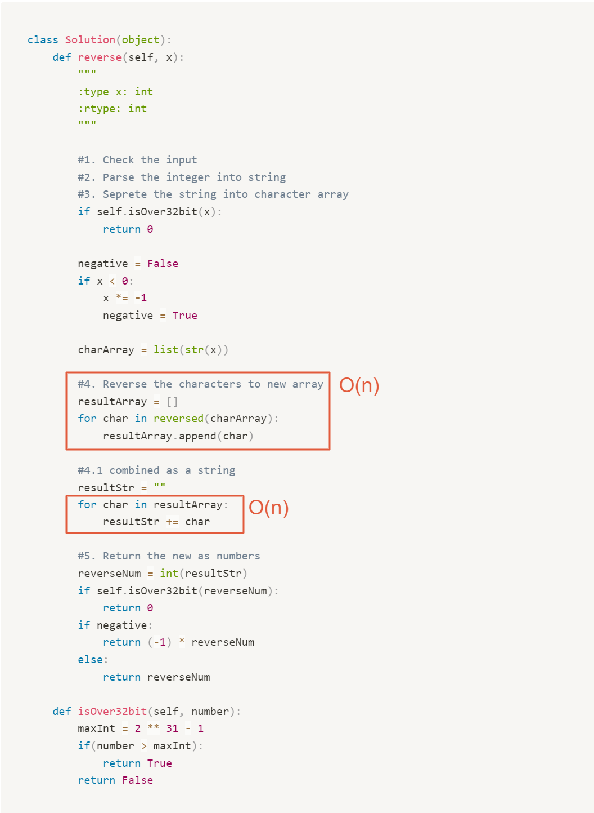

# 0007. Reverse Integer

|            |                                                |
| ---------- | ---------------------------------------------- |
| Category   | Math                                           |
| Difficulty | medium                                         |
| Link       | https://leetcode.com/problems/reverse-integer/ |

# Clarification

1. Check the inputs and outputs
    - INPUT: a signed 32-bit integer
    - OUTPUT: a signed integer
2. Check the main goal
    1. Check the size
    2. Reverse the digits
    3. HOW to check 32-bit integer
        
        ⇒ 直接把最大值乘出來進行比較
        

# Naive Solution

### Thought Process

1. Check the input
2. Parse the integer into string
3. Seperate the string into character array
4. Reverse the characters to new array
5. Combined new array as  a string
6. Return the new as numbers
- Implement
    
    ```python
    class Solution(object):
        def reverse(self, x):
            """
            :type x: int
            :rtype: int
            """
            
            #1. Check the input
            #2. Parse the integer into string
            #3. Seprete the string into character array
            if self.isOver32bit(x):
                return 0
            
            negative = False
            if x < 0:
                x *= -1
                negative = True
                
            charArray = list(str(x))
    
            #4. Reverse the characters to new array
            resultArray = []
            for char in reversed(charArray):
                resultArray.append(char)
                
            #4.1 combined as a string
            resultStr = ""
            for char in resultArray:
                resultStr += char
                
            #5. Return the new as numbers
            reverseNum = int(resultStr)
            if self.isOver32bit(reverseNum):
                return 0
            if negative: 
                return (-1) * reverseNum
            else:
                return reverseNum
            
        def isOver32bit(self, number):
            maxInt = 2 ** 31 - 1
            if(number > maxInt):
                return True
            return False
    ```
    

### Complexity

- O(n)
    - 兩個 for loop
        
        
        

### Problems & Improvement

- python 自有 reverse array 的 method
    
    
    
- integer → string array → integer 很多道轉換
    
    ⇒ 直接用取 % 的方式進行轉換
    

# Improvement

### Thought Process

1. check the integer size
2. mod the integer and add it to result
3. check the integer size
- Implement
    
    ```python
    class Solution(object):
        def reverse(self, x):
            """
            :type x: int
            :rtype: int
            """
            
            #1. check the integer size
            if self.isOver32bit(x):
                return 0
            
            negative = False
            if x < 0:
                negative = True
                x *= (-1)
            
            #2. mod the integer and add it to result
            result = 0
            while x > 0:
                result *= 10
                result += (x % 10)
                x /= 10
    
            #3. check the integer size
            if self.isOver32bit(result):
                return 0
            if negative:
                return -1 * result
            else:
                return result
            
        def isOver32bit(self, number):
            maxInt = 2 ** 31 - 1
            if(number > maxInt):
                return True
            return False
    ```
    

### Complexity

- Time complexity: O(n)
- Space complexity: O(1)

# Check special cases, check error

- Special case
    - 0
    - 10

# Notes

- signed 32 bit integer
    - max integer = $2^{31} -1$
    - need **one bit reserve as the sign bit.**