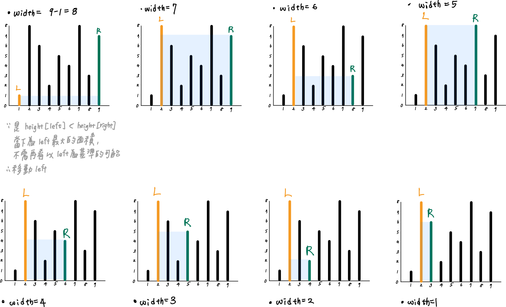

# 0011. Container With Most Water

* Difficulty: medium
* Link: https://leetcode.com/problems/container-with-most-water/
* Topics: Array-String, Multiple-Pointers

# Clarification

1. Check the inputs and outputs
    - INPUT:List[int]
    - OUTPUT: integer

# Naive Solution

### Thought Process

- area
    - min(height[i], height[j]) * (abs(i-j))
- for loop to enumerate all possible result
- Implement
    
    ```python
    class Solution:
        def maxArea(self, height: List[int]) -> int:
            maxArea = min(height[0], height[-1]) * (len(height)-1)
            for left in range(len(height) - 1):
                for right in range(left + 1, len(height)):
                    area = min(height[left], height[right]) * (right - left)
                    maxArea = max(area, maxArea)
            return maxArea
    ```
    

### Complexity

- Time complexity:$O(n^2)$
- Space complexity:$O(1)$

### Problems & Improvement

- Time Limit Exceeded

# Improvement

### Thought Process

- 當 (1,9) height[1] < height[9]
    - 當寬度縮小時，只有兩個可能的情境
        - height[left’] ≥ height[1]
            - 以 height[1] 為高，width 已縮小，所以面積小於以 (1,9) 為邊長的情境
        - height[left’] < height[1]
            - 以 height[left'] 為高，但 width 縮小加上 height < height[1]，所以面積小於以 (1,9) 為邊長的情境
    - 以 height 為邊長的情境：(1,8) , (1,7) , (1,6) , ... , (1,2) 一定都比 (1,9) 小，所以不需要再看以 1 為邊界的區域
    - 因此將 Left 往右移動
- 遍歷每個寬度
    
    
    
- Implement
    
    ```python
    class Solution:
        def maxArea(self, height: List[int]) -> int:
            maxArea = min(height[0], height[-1]) * (len(height)-1)
            left, right = 0, len(height)-1
            for w in range(len(height) - 1, 0, -1):
                if height[left] < height[right]:
                    maxArea = max(height[left] * w, maxArea)
                    left += 1
                else:
                    maxArea = max(height[right] * w, maxArea)
                    right -= 1
            return maxArea
    ```
    

### Complexity

- Time complexity:$O(n)$
- Space complexity:$O(1)$

# Note

- **[O(N) 7-line Python solution, 72ms](https://leetcode.com/problems/container-with-most-water/discuss/6131/O(N)-7-line-Python-solution-72ms)**