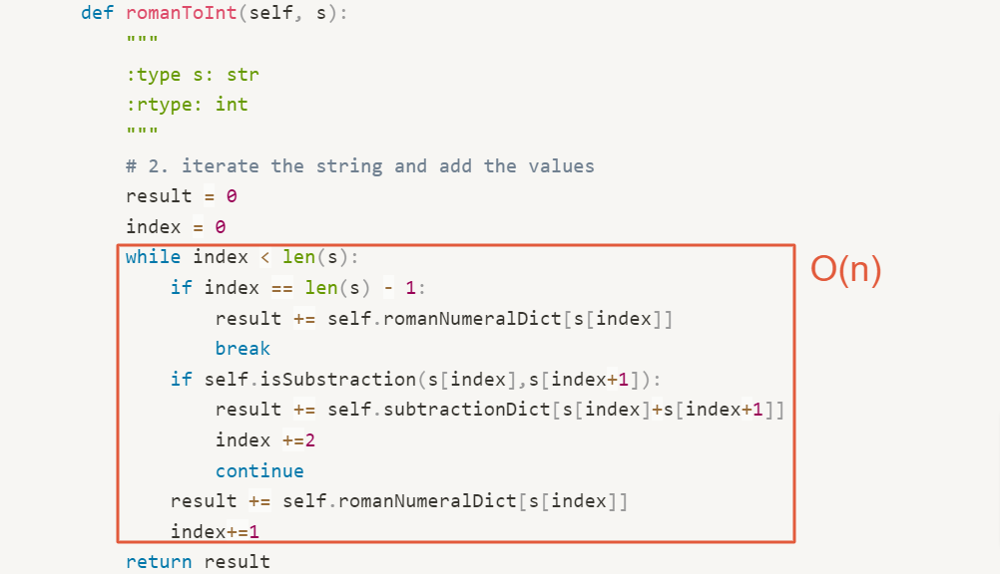

# 0013. Roman to Integer

- Category: Map
- Difficulty: easy
- Link: https://leetcode.com/problems/roman-to-integer/

# Clarification

1. Check the inputs and outputs
    - INPUT: string (Roman numeral)
    - OUTPUT: intger
2. Check the main goal
    - mapping the Roman numeral to related integer

# Naive Solution

<aside>
💡 從最簡單的方法開始 easy solution → only speak out

</aside>

### Thought Process

1. Create a map to mapping from Roman Symbol to values
    - original part
    - subtraction combination
2. iterate the string and add the values
    - is the next value whether is the subtraction combination
        - add the substraction combination
    - add the original value
3. return
- Implement
    
    ```python
    class Solution(object):
        romanNumeralDict = {
            'I':1,
            'V':5,
            'X':10,
            'L':50,
            'C':100,
            'D':500,
            'M':1000
        }
        subtractionDict = {
            'IV':4,
            'IX':9,
            'XL':40,
            'XC':90,
            'CD':400,
            'CM':900
        }
        def romanToInt(self, s):
            """
            :type s: str
            :rtype: int
            """
            # 2. iterate the string and add the values
            result = 0
            index = 0
            while index < len(s):
                if index == len(s) - 1:
                    result += self.romanNumeralDict[s[index]]
                    break
                if self.isSubstraction(s[index],s[index+1]):
                    result += self.subtractionDict[s[index]+s[index+1]]
                    index +=2
                    continue
                result += self.romanNumeralDict[s[index]]
                index+=1
            return result
        
        def isSubstraction(self, char1, char2):
            if (char1+char2) in self.subtractionDict:
                return True
            return False
    ```
    

### Complexity

- Time complexity: O(n) iterate the character once
    
    
    
- Space complexity: O(n)

### Problems & Improvement

<aside>
💡 解釋該解法的問題、可以往哪個方向改善 (一次改善一個問題)

- 瓶頸點在哪裡
- 哪些部分是不需要的
</aside>

- Do I need so many if ?
    
    
    

# Improvement

### Thought Process

1. 
- Implement
    
    ```python
    
    ```
    

### Complexity

- Time complexity:
- Space complexity:

# Check special cases, check error

<aside>
💡 How you make break with the function

- 確認特別的 input 是否影響結果
- 確認可能已知的 error
- 有考慮到哪些 assumption
</aside>

- 

# Note

<aside>
💡 提出可以再改善的方式 (都可以用口語表達即可)

- 可針對特定語言擁有的 function (快速解決問題的方法)
    - 指出此方法的優點 eg. readable
- 精簡成新的 method
    - 一個 method 一件事情
</aside>

<aside>
💡 相關 Note 紀錄

</aside>

- Impressive Solution in discussion
    - find the insight
        - only substract when the prev value is smaller than the current one
        - iterative backward
        
        ```python
        def romanToInt(self, s: str) -> int:
        	res, prev = 0, 0
        	dict = {'I':1, 'V':5, 'X':10, 'L':50, 'C':100, 'D':500, 'M':1000}
        	for i in s[::-1]:          # rev the s
        		if dict[i] >= prev:
        			res += dict[i]     # sum the value iff previous value same or more
        		else:
        			res -= dict[i]     # substract when value is like "IV" --> 5-1, "IX" --> 10 -1 etc 
        		prev = dict[i]
        	return res
        ```