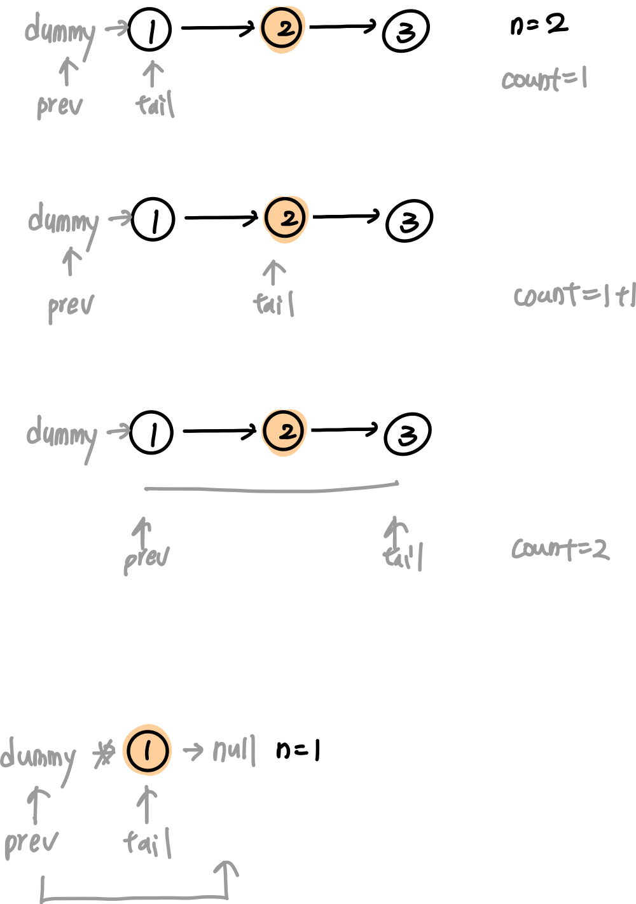

# 0019. Remove Nth Node From End of List

* Difficulty: medium
* Link: https://leetcode.com/problems/remove-nth-node-from-end-of-list/
* Topics: Linked-List

# Clarification

1. Check the inputs and outputs
    - INPUT: Linked List
    - OUTPUT: Linked List

# Naive Solution

### Thought Process

1. 兩個 pointer
    1. 一個指向 prev
    2. 一個去遍歷
2. 當遍歷跟 prev 相差 < n 時，只有遍歷 pointer 往前
3. 當遍歷跟 prev 相差 == n 時，一起遍歷，直到遍歷的 == null 時， prev = prev.next.next
- Examples
    
    
    
- Implement
    
    ```python
    # Definition for singly-linked list.
    # class ListNode:
    #     def __init__(self, val=0, next=None):
    #         self.val = val
    #         self.next = next
    class Solution:
        def removeNthFromEnd(self, head: Optional[ListNode], n: int) -> Optional[ListNode]:
            """
            two pointer: prev and tail
            
            """
            prev = dummy = ListNode(0, head)
            tail = head
            count = 1
            while tail.next:
                if count == n:
                    prev = prev.next
                else:
                    count += 1
                tail = tail.next
            
            if prev and prev.next:
                prev.next = prev.next.next
            
            return dummy.next
    ```
    

### Complexity

- Time complexity:$O(n)$
- Space complexity:$O(1)$

# Improvement

- 精簡寫法
    
    
    
- Implement
    
    ```python
    # Definition for singly-linked list.
    # class ListNode:
    #     def __init__(self, val=0, next=None):
    #         self.val = val
    #         self.next = next
    class Solution:
        def removeNthFromEnd(self, head: Optional[ListNode], n: int) -> Optional[ListNode]:
            """
            two pointer: prev and tail
            
            """
            prev = dummy = ListNode(0, head)
            tail = head
            for i in range(n):
                tail = tail.next
            while tail:
                prev = prev.next
                tail = tail.next
            
            prev.next = prev.next.next
            
            return dummy.next
    ```