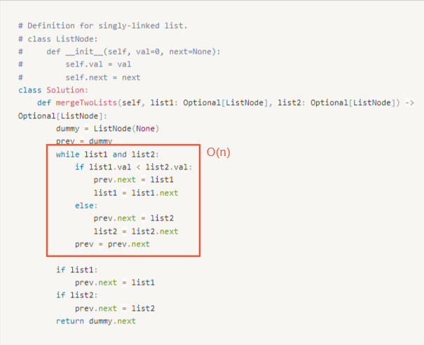

# 0021. Merge Two Sorted Lists

* Difficulty: easy
* Link: https://leetcode.com/problems/merge-two-sorted-lists/
* Topics: Linked-List

# Clarification

1. Check the inputs and outputs
    - INPUT: two Linked List
    - OUTPUT: one Linked List

# Naive Solution

### Thought Process

- 使用 dummy node
1. 兩個 pointer 分別指向兩個 linked list
2. 將 next 指向 val 較小的那個 Node
- Implement
    
    ```python
    # Definition for singly-linked list.
    # class ListNode:
    #     def __init__(self, val=0, next=None):
    #         self.val = val
    #         self.next = next
    class Solution:
        def mergeTwoLists(self, list1: Optional[ListNode], list2: Optional[ListNode]) -> Optional[ListNode]:
            dummy = ListNode(None)
            prev = dummy
            while list1 and list2:
                if list1.val < list2.val:
                    prev.next = list1
                    list1 = list1.next
                else:
                    prev.next = list2
                    list2 = list2.next
                prev = prev.next
            
            if list1:
                prev.next = list1
            if list2:
                prev.next = list2
            return dummy.next
    ```
    

### Complexity

- Time complexity:$O(n)$
    
    
    
- Space complexity:$O(1)$