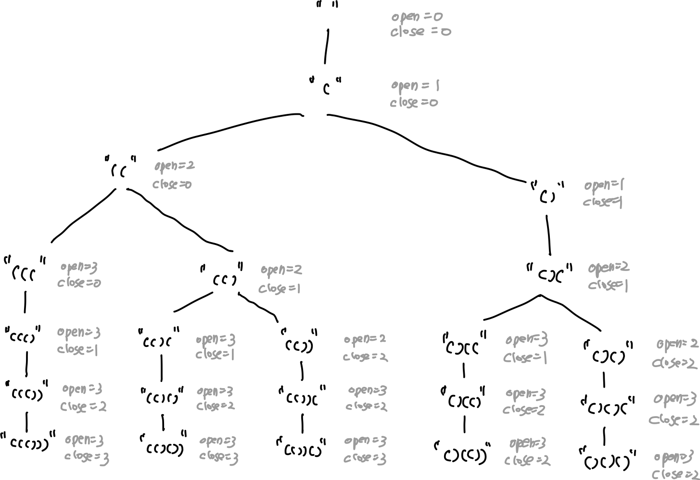

# 0022. Generate Parentheses

* Difficulty: medium
* Link: https://leetcode.com/problems/generate-parentheses/
* Topics: Backtracking

# Clarification

1. Check the inputs and outputs
    - INPUT:
        - n: int
    - OUTPUT: List[String]

# Naive Solution

### Thought Process

- Backtracking
    - 停止條件
        - open == n and close == n
    - 非停止條件
        - 當 open < n
            - subset = subset + open
        - 當 close < open
            - subset = subest + close



- Implement
    
    ```python
    class Solution(object):
        def generateParenthesis(self, n):
            """
            :type n: int
            :rtype: List[str]
            """
            result = []
            
            def backtracking(substr, num_open, num_close):
                if num_open == n and num_close == n:
                    return result.append(substr)
                if num_open < n:
                    backtracking(substr + "(", num_open + 1, num_close)
                if num_close < num_open:
                    backtracking(substr + ")", num_open, num_close+1)
            
            backtracking("", 0,0)
            return result
    ```
    

# Note

- **[Generate Parentheses - Stack - Leetcode 22](https://www.youtube.com/watch?v=s9fokUqJ76A)**