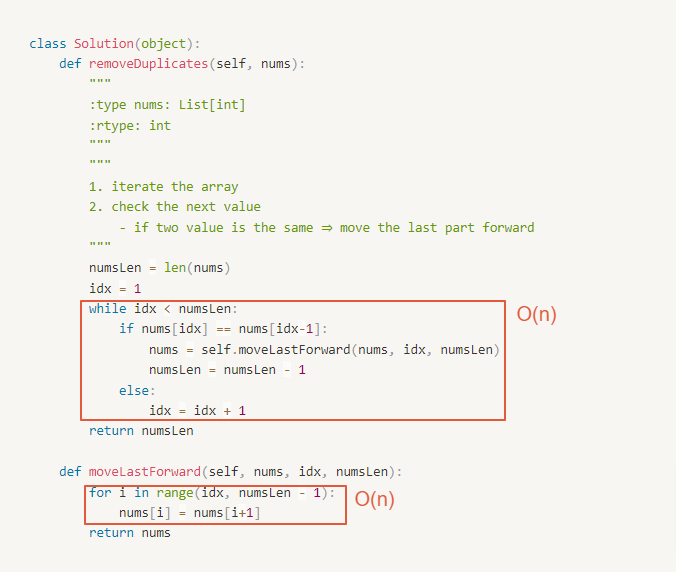

# 0026. Remove Duplicates from Sorted Array

- Category: Array
- Difficulty: easy
- Link: https://leetcode.com/problems/remove-duplicates-from-sorted-array/

# Clarification

1. Check the inputs and outputs
    - INPUT: List[int]
    - OUTPUT: List[int]
2. Check the main goal
    - remove duplicates
    - maintain the same array

# Naive Solution

### Thought Process

1. iterate the array
2. check the next value
    - if two value is the same
        
        ⇒ move the last part forward
        
        - forloop to move forward
- Implement
    - ⚠️ Time Limit Exceeded
    
    ```python
    class Solution(object):
        def removeDuplicates(self, nums):
            """
            :type nums: List[int]
            :rtype: int
            """
            """
            1. iterate the array
            2. check the next value
                - if two value is the same ⇒ move the last part forward
            """
            numsLen = len(nums)
            idx = 1
            while idx < numsLen:
                if nums[idx] == nums[idx-1]:
                    nums = self.moveLastForward(nums, idx, numsLen)
                    numsLen = numsLen - 1
                else:
                    idx = idx + 1
            return numsLen
        
        def moveLastForward(self, nums, idx, numsLen):
            for i in range(idx, numsLen - 1):
                nums[i] = nums[i+1]
            return nums
    ```
    

### Complexity

- Time complexity: $O(n^2)$
    
    
    
- Space complexity: $O(n)$

### Problems & Improvement

- 把所有 Element 往前移的方式太耗時了
    - ~~能用 linkedlist 嗎~~
- 使用 index 儲存的方式，最後再看要移動多少 index ?
    - ~~和原本的做法一樣~~
- 使用 swap 的方式

# Improvement

### Thought Process

1. create two pointer
    1. for result array index
    2. for current iterate
2. iterate the array
    1. if the value of current pointer is the same as the value of result array index
        1. num of length - 1
    2. not the same
        1. swap the value of current pointer and result array index + 1
        2. result array index + 1
    3. move the current pointer
3. return the length
- Implement
    
    ```python
    class Solution(object):
        def removeDuplicates(self, nums):
            """
            :type nums: List[int]
            :rtype: int
            """
            """
            1. create two pointer
                1. for result array index
                2. for current iterate
            2. iterate the array
                1. if the value of current pointer is the same as the value of result array index
                    1. num of length - 1
                2. not the same
                    1. swap the value of current pointer and result array index + 1
                    2. result array index + 1
                3. move the current pointer
            3. return the length
            """
            idx = 0
            currentIdx = 1
            numLen = len(nums)
            while currentIdx < len(nums):
                if nums[currentIdx] == nums[idx]:
                    numLen = numLen - 1
                else:
                    nums[idx + 1] = nums[currentIdx]
                    idx = idx + 1
                currentIdx = currentIdx + 1
            return numLen
    ```
    

### Complexity

- Time complexity:
    
    
    
- Space complexity: $O(n)$

# Check special cases, check error

- 

# Note
