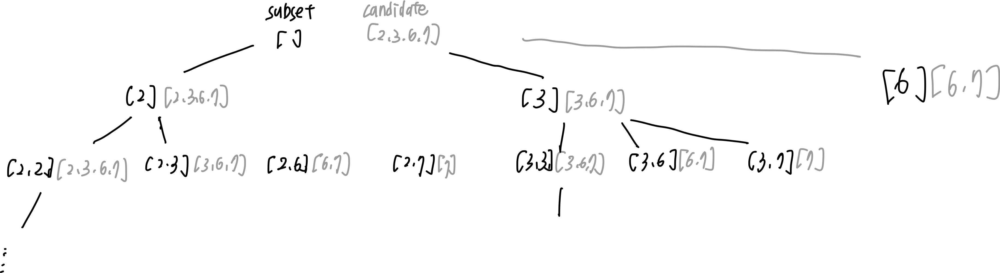
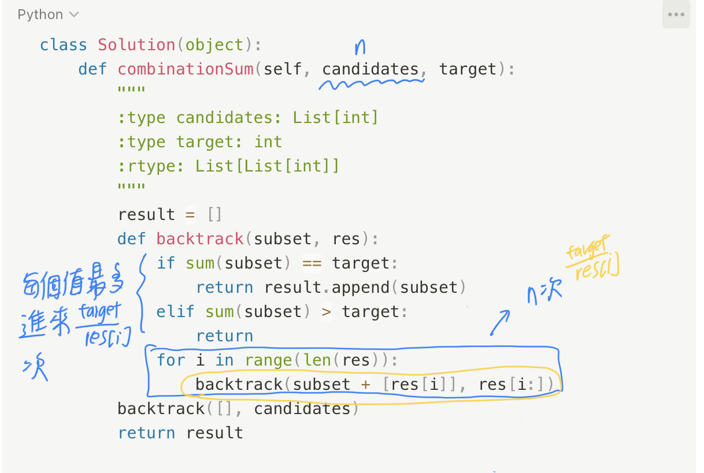

# 39. Combination Sum

* Difficulty: medium
* Link: https://leetcode.com/problems/combination-sum/
* Topics: Backtracking

# Clarification

1. Check the inputs and outputs
    - INPUT:
        - List[int] candiates
        - int target
    - OUTPUT: List[List[int]]

# Naive Solution

### Thought Process

1. 停止條件：
    1. 加總等於 target
    2. 加總大於 target
2. subset = 現有 + candiate[i]
3. 新的 candidate 則是從 candidate[i] 之後開始 (包含 candidate[i], 因為 The **same**
 number may be chosen from `candidates` an **unlimited number of times**.)



- Implement
    
    ```python
    class Solution(object):
        def combinationSum(self, candidates, target):
            """
            :type candidates: List[int]
            :type target: int
            :rtype: List[List[int]]
            """
            result = []
            def backtrack(subset, res):
                if sum(subset) == target:
                    return result.append(subset)
                elif sum(subset) > target:
                    return
                for i in range(len(res)):
                    backtrack(subset + [res[i]], res[i:])
            backtrack([], candidates)
            return result
    ```
    

### Complexity

- Time complexity:
    - $O(n^n)$
        
        
        
    - $O(k*2^n)$
        - **[Deadbeef-ECE 039_Combination_Sum.java](https://github.com/Deadbeef-ECE/Interview/blob/master/Leetcode/BackTracking/039_Combination_Sum.java)**
- Space complexity:

### Problems & Improvement

- 可以更早排除不須 backtrack 的數字
    - 當 candidate > target 時就不用進去 backtrack 了
        - Implement
            
            ```python
            class Solution(object):
                def combinationSum(self, candidates, target):
                    """
                    :type candidates: List[int]
                    :type target: int
                    :rtype: List[List[int]]
                    """
                    result = []
                    def backtrack(subset, res):
                        if sum(subset) == target:
                            return result.append(subset)
                        elif sum(subset) > target:
                            return
                        for i in range(len(res)):
                            if res[i] > target:
                                return
                            backtrack(subset + [res[i]], res[i:])
                    backtrack([], candidates)
                    return result
            ```