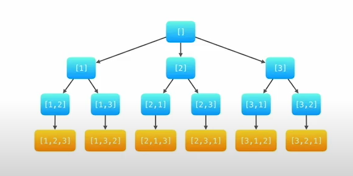

# 0046. Permutations

* Difficulty: medium
* Link: https://leetcode.com/problems/permutations/
* Topics: Array-String, Backtracking, DFS-BFS
* highlight: 用 DFS 的概念

# Clarification

1. Check the inputs and outputs
    - INPUT:List[int]
    - OUTPUT:List[List[int]]

# Improvement

### Thought Process

- DFS
    
    
    
- state variable
    - depth 遞迴到第幾層
    - path 已經選了哪些數
    - used 紀錄已經選擇的數值 (以空間換時間)
- DFS 概念
    - 走到底再往回走，看有沒有其他路往下走
    - 走到底：result 的長度已經跟原始長度一樣
    - 還沒走到底：在unused之中選出一個元素放進去
- Implement
    
    ```python
    class Solution:
        def permute(self, nums: List[int]) -> List[List[int]]:
            result = []
            visited = {}
            for num in nums:
                visited[num] = False
                
            def permutate(subset, res):
                if len(subset) == len(nums):
     
    ```
    

### Complexity

- Time complexity:$O(N!)$
    - 每個元素去找，下一個元素選剩下的
    
    
    
- Space complexity: $O(N)$
    - 額外用 dictionary 存是否訪問過

# Note

- **[46. Permutations 全排列 【LeetCode 力扣题解】](https://www.youtube.com/watch?v=w4SjNXKLsv4)**
- **[46. Permutations](https://leetcode.wang/)**