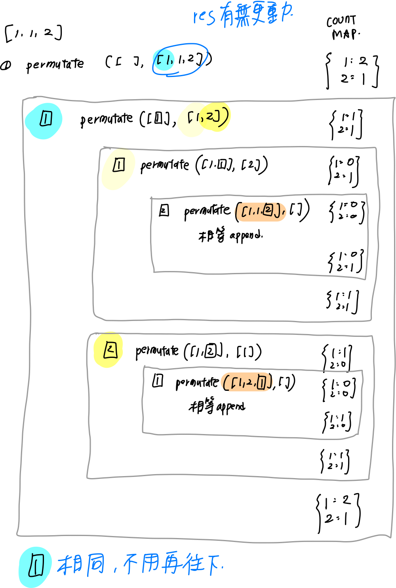

# 0047. Permutations II

* Difficulty: medium
* Link: https://leetcode.com/problems/permutations-ii/
* Topics: Array-String, Backtracking, DFS-BFS

# Clarification

1. Check the inputs and outputs
    - INPUT: List[int]
    - OUTPUT:List[List[int]]

# Naive Solution

### Thought Process

1. DFS
2. 走到底的條件：subset個數與原始相同
3. 是否往下找：~~出現次數是否達到該數字的數量~~ res 是否和前一個 res 一樣



- Implement
    
    ```python
    class Solution:
        def permuteUnique(self, nums: List[int]) -> List[List[int]]:
            result = []
            len_of_nums = len(nums)
            nums.sort()
    
            def permutate(subset, res):
                if len(subset) == len_of_nums:
                    return result.append(subset)
                
                for i in range(len(res)):
                    if i > 0 and res[i] == res[i-1]:
                        continue
                    permutate(subset +[res[i]], res[:i] + res[i+1:])
            
            permutate([], nums)
            return result
    ```
    

### Complexity

- Time complexity: O(N!)
- Space complexity: O(1) 未使用額外的空間