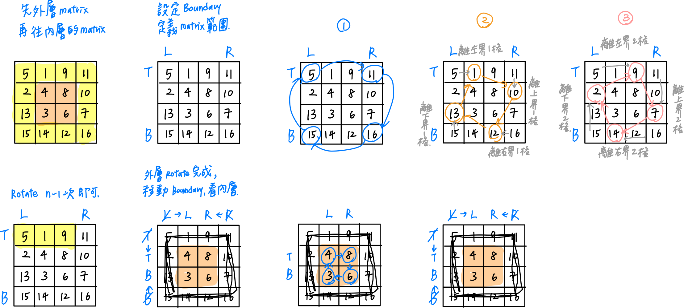

# 0048. Rotate Image

- Difficulty: medium
- Link: https://leetcode.com/problems/rotate-image/
- Topics: Array-String, Matrix

# Clarification

1. Check the inputs and outputs
    - INPUT: List[List[int]]
    - OUTPUT: List[List[int]]
2. Check the main goal
    - You have to rotate the image **[in-place](https://en.wikipedia.org/wiki/In-place_algorithm)**

# Naive Solution

### Thought Process

1. 定義 matrix 邊界，設定上下左右邊界
2. 由左上開始 rotate
    
    
    
- Rotate 的方式
    
    
    
- Implement
    
    ```python
    class Solution:
        def rotate(self, matrix: List[List[int]]) -> None:
            """
            Do not return anything, modify matrix in-place instead.
            """
            left = 0
            right = len(matrix[0]) - 1
            
            while left < right:
                for i in range(0, right - left):
                    top, bottom = left, right
                    left_top = matrix[top][left + i]
                    matrix[top][left + i] = matrix[bottom - i][left]
                    matrix[bottom - i][left] = matrix[bottom][right - i]
                    matrix[bottom][right - i] = matrix[top + i][right]
                    matrix[top + i][right] = left_top
                left += 1
                right -= 1
    ```
    

### Complexity

- Time complexity: $O(n^2)$
- Space complexity: $O(1)$

### Problems & Improvement

- 多個位置轉換，需抓出好的基準點 (例如 boundary )，較不易混淆

# Improvement

### Thought Process

1. 轉置矩陣
2. reverse column


- 交換的方式
    
    
    
- Implement
    
    ```python
    class Solution:
        def rotate(self, matrix: List[List[int]]) -> None:
            """
            Do not return anything, modify matrix in-place instead.
            """
            lenCol = len(matrix)
            for i in range(0, lenCol):
                for j in range(i + 1, lenCol):
                    matrix[i][j], matrix[j][i] = matrix[j][i], matrix[i][j]
                    
            for i in range(0, lenCol):
                for j in range(0, lenCol // 2):
                    matrix[i][j], matrix[i][lenCol - 1 -j] = matrix[i][lenCol - 1 -j], matrix[i][j]
    ```
    

### Complexity

- Time complexity: $O(n^2)$
- Space complexity: $O(1)$

# Check special cases, check error

- 

# Note

- [Rotate Image - Matrix - Leetcode 48](https://www.youtube.com/watch?v=fMSJSS7eO1w)