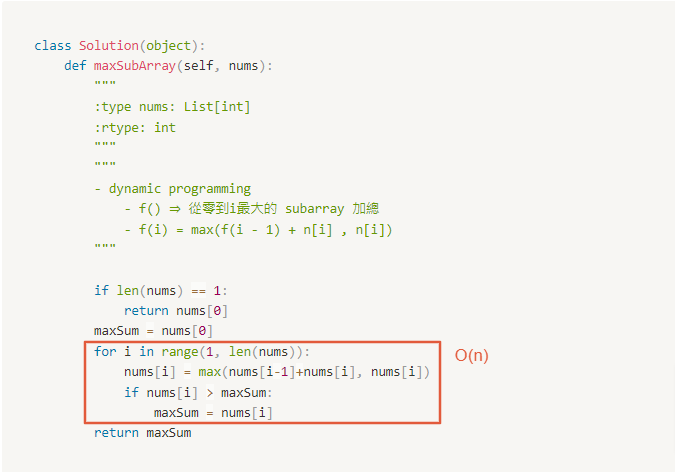

# 0053. Maximum Subarray

Difficulty: easy
Link: https://leetcode.com/problems/maximum-subarray/
Topics: Array-String

# Clarification

1. Check the inputs and outputs
    - INPUT: List[int]
    - OUTPUT: integer
2. Check the main goal
    - find the contiguous subarray which has the largest sum

# Naive Solution

<aside>
💡 從最簡單的方法開始 easy solution → only speak out

</aside>

### Thought Process

- wrong answer: subarray 可能在很中間
    1. iterate all element and sum all the array
    2. two pointer from the beginning and the end
        1. if move to forward make the summation better ⇒ forward pointer ++
        2. if move backward make the summation better ⇒ backward pointer - -
        3. both not better ⇒ return sum
- dynamic programming
    - f() ⇒ 從零到i最大的 subarray 加總
    - f(i) = max(f(i - 1) + n[i] , n[i])
- Implement
    
    ```python
    class Solution(object):
        def maxSubArray(self, nums):
            """
            :type nums: List[int]
            :rtype: int
            """
            """
            - dynamic programming
                - f() ⇒ 從零到i最大的 subarray 加總
                - f(i) = max(f(i - 1) + n[i] , n[i])
            """
            
            if len(nums) == 1:
                return nums[0]
            maxSum = nums[0]
            for i in range(1, len(nums)):
                nums[i] = max(nums[i-1]+nums[i], nums[i])
                if nums[i] > maxSum:
                    maxSum = nums[i]
            return maxSum
    ```
    

### Complexity

- Time complexity: $O(n)$
    
    
    
- Space complexity:$O(n)$

### Problems & Improvement

<aside>
💡 解釋該解法的問題、可以往哪個方向改善 (一次改善一個問題)

- 瓶頸點在哪裡
- 哪些部分是不需要的
</aside>

- 

# Improvement

### Thought Process

1. 
- Implement
    
    ```python
    
    ```
    

### Complexity

- Time complexity:
- Space complexity:

# Check special cases, check error

<aside>
💡 How you make break with the function

- 確認特別的 input 是否影響結果
- 確認可能已知的 error
- 有考慮到哪些 assumption
</aside>

- 

# Note

<aside>
💡 提出可以再改善的方式 (都可以用口語表達即可)

- 可針對特定語言擁有的 function (快速解決問題的方法)
    - 指出此方法的優點 eg. readable
- 精簡成新的 method
    - 一個 method 一件事情
</aside>

<aside>
💡 相關 Note 紀錄

</aside>