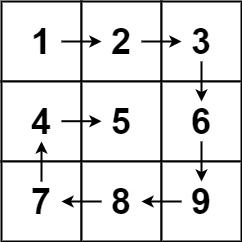

# 0054. Spiral Matrix

- Difficulty: medium
- Link: https://leetcode.com/problems/spiral-matrix/
- Topics: Array-String, Matrix

# Clarification

1. Check the inputs and outputs
    - INPUT: List[List[int]]
    - OUTPUT: List[int]
2. Check the main goal
    - traversal the matrix in spiral order
        
        ```
        Input: matrix = [[1,2,3],[4,5,6],[7,8,9]]
        Output: [1,2,3,6,9,8,7,4,5]
        ```
        
        
        

# Naive Solution

### Thought Process

1. the direction sequence is right → down → left → up
2. boundary Left, right, top, bottom
    1. go through and shrink the boundary
- Implement
    
    ```python
    class Solution:
           
        def spiralOrder(self, matrix: List[List[int]]) -> List[int]:
            """
    				1. the direction sequence is right → down → left → up
            2. boundary Left, right, top, bottom
                - go through and shrink the boundary
            """
            
            result = []
            
            left = 0
            right = len(matrix[0])
            top = 0
            bottom = len(matrix)
            
            j = top
            while left < right and top < bottom:
    
                #right
                for i in range(left, right):
                    result.append(matrix[top][i])
                top += 1
    
                # down
                for j in range(top, bottom):
                    result.append(matrix[j][right - 1])
                right -= 1
                
                if not (left < right and top < bottom):
                    break
    
                # left
                for i in range(right - 1, left -1, -1):
                    result.append(matrix[bottom - 1][i])
                bottom -= 1
    
                # up
                for j in range(bottom - 1, top - 1, -1):
                    result.append(matrix[j][left])
                left += 1
                    
            return result
    ```
    

### Complexity

- Time complexity: $O(m*n)$
- Space complexity:$O(m*n)$

### Problems & Improvement

- 

# Improvement

### Thought Process

1. 
- Implement
    
    ```python
    
    ```
    

### Complexity

- Time complexity:
- Space complexity:

# Check special cases, check error

- 

# Note

- [Spiral Matrix - Microsoft Interview Question - Leetcode 54](https://www.youtube.com/watch?v=BJnMZNwUk1M)