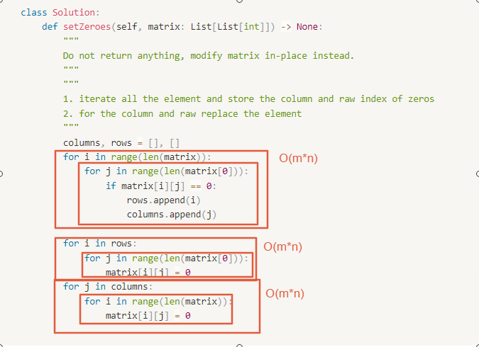

# 0073. Set Matrix Zeroes

- Difficulty: medium
- Link: https://leetcode.com/problems/set-matrix-zeroes/
- Topics: Array-String

# Clarification

1. Check the inputs and outputs
    - INPUT: List[List[int]]
    - OUTPUT: none
2. Check the main goal
    - do it in place

# Naive Solution

### Thought Process

1. iterate all the element and store the column and raw index of zeros
2. for the column and raw replace the element
- Implement
    
    ```python
    class Solution:
        def setZeroes(self, matrix: List[List[int]]) -> None:
            """
            Do not return anything, modify matrix in-place instead.
            """
            """
            1. iterate all the element and store the column and raw index of zeros
            2. for the column and raw replace the element
            """
            columns, rows = [], []
            for i in range(len(matrix)):
                for j in range(len(matrix[0])):
                    if matrix[i][j] == 0:
                        rows.append(i)
                        columns.append(j)
                        
            for i in rows:
                for j in range(len(matrix[0])):
                    matrix[i][j] = 0
            for j in columns:
                for i in range(len(matrix)):
                    matrix[i][j] = 0
    ```
    

### Complexity

- Time complexity: $O(m*n)$
    
    
    
- Space complexity:$O(n+m)$

### Problems & Improvement

- 能否降低 space 到 $O(1)$
    - 使用 row 0, column 0 當作 marker

# Improvement

### Thought Process

1. iterate all the element and mark the column and raw index of zeros
    1. use the row 0 column 0 as marker
2. iterate the 0 row the replace else
- Implement
    
    ```python
    class Solution:
        def setZeroes(self, matrix: List[List[int]]) -> None:
            """
            Do not return anything, modify matrix in-place instead.
            """
            """
            1. iterate all the element and mark the column and raw index of zeros
                - use the row 0 column 0 as marker
            2. iterate the 0 row the repace else
            """
            isFirstRowZero = 0 in matrix[0]
            for i in range(1,len(matrix)):
                for j in range(len(matrix[0])):
                    if matrix[i][j] == 0:
                        matrix[i][0] = 0
                        matrix[0][j] = 0
                        
            for i in range(1,len(matrix)):
                for j in range(len(matrix[0])-1,-1,-1):
                    if matrix[i][0] == 0 or matrix[0][j] == 0:
                        matrix[i][j] = 0
    
            if isFirstRowZero:
                matrix[0] = [0] * len(matrix[0])
    ```
    

### Complexity

- Time complexity:$O(m*n)$
- Space complexity:$O(1)$

# Check special cases, check error

- 

# Note

- 遍歷的順序很重要!!
- **[Java/Python O(1) space 11 lines solution](https://leetcode.com/problems/set-matrix-zeroes/discuss/26115/JavaPython-O(1)-space-11-lines-solution)**
- [Set Matrix Zeroes - In-place - Leetcode 73](https://www.youtube.com/watch?v=T41rL0L3Pnw&t=260s)