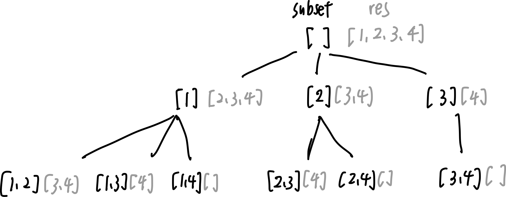

# 77. Combinations

* Difficulty: medium
* Link: https://leetcode.com/problems/combinations/
* Topics: Backtracking

# Clarification

1. Check the inputs and outputs
    - INPUT:
        - int n : the range [1,n]
        - int k : pick k numbers
    - OUTPUT: List[List[int]]

# Naive Solution

### Thought Process

- [NOT working] 用於 k 為少數時
    1. 使用兩個 pointer
    2. 第一個放一開始，第二個從第一個的下一個開始移動
    3. 直到第二個 pointer 指到 Null
- 停止條件：當 subset 的長度 = k 時
    
    
    
- Implement
    
    ```python
    class Solution(object):
        def combine(self, n, k):
            """
            :type n: int
            :type k: int
            :rtype: List[List[int]]
            """
            result = []
            def combination(subset, res):
                if len(subset) == k:
                    return result.append(subset)
                for i in range(len(res)):
                    combination(subset + [res[i]], res[i+1:])
            combination([], range(1,n+1))
            return result
    ```
    

### Complexity

- Time complexity:
    - O(C(n,k))
    - $C^n_k=(n!)/k!(n-k)!$
- Space complexity: O(k)
    - subset 的大小