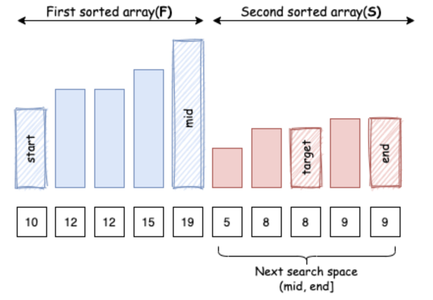
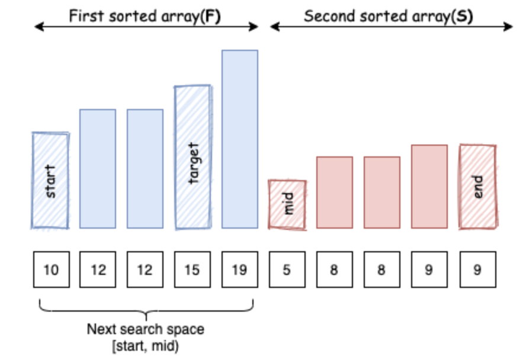
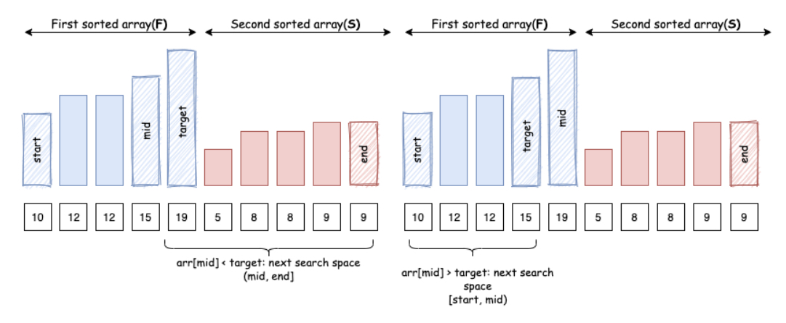
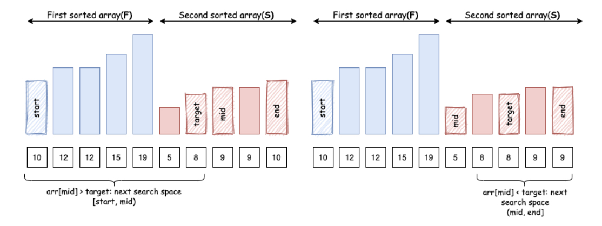

# 0081. Search in Rotated Sorted Array II

* Difficulty: medium
* Link: https://leetcode.com/problems/search-in-rotated-sorted-array-ii/
* Topics: Binary-Search
* highlight: 排除 nums[middle] == nums[left] 的情況

# Clarification

1. Check the inputs and outputs
    - INPUT:
        - List[int] nums
        - int target
    - OUTPUT:

# Solution (Binary Search)

### Thought Process

- 因為 nums 可重複，所以會遇到 nums[middle] == nums[left]
    
    ⇒ middle 可能在左半也可能在右半
    
    ⇒ 需增加此判斷並移動 left 位置到 ≠ nums[middle] 的情況
    
- Implement
    
    ```python
    class Solution:
        def search(self, nums: List[int], target: int) -> int:
            left = 0
            right = len(nums) - 1
            while left <= right:
                middle = (left + right) // 2
                if target == nums[middle]:
                    return True
                
                if nums[middle] == nums[left]:
                    left += 1
                    continue
                
                # left sorted portion
                if nums[middle] >= nums[left]:
                    if target > nums[middle] or target < nums[left]:
                        left = middle + 1
                    else:
                        right = middle - 1
                # right sorted portion
                else:
                    if target < nums[middle] or target > nums[right]:
                        right = middle - 1
                    else:
                        left = middle + 1
            return False
    ```
    

### Complexity

- Time complexity: O(n)
    - 因為當 nums[middle] == nums[left] 要一個一個往右移
- Space complexity: O(1)

# Solution (Binary Search)

### Thought Process

- 分析 target 與 middle 分別位於哪個 array，再來決定 search space
- #case 1: middel 在第一個 array、target 在第二個 array
    
    
    
- #case 2: middel 在第二個 array、target 在第一個 array
    
    
    
- #case 3: middel 與 target 都在第一個 array
    - 因為在同個 sorted array 代表有直接的大小關係
    
    
    
- #case 4: middel 與 target 都在第二個 array
    
    
    
- Implement
    
    ```python
    class Solution:
        def search(self, nums: List[int], target: int) -> bool:
            left = 0
            right = len(nums) - 1
            while left <= right:
                middle = (left + right) // 2
                if target == nums[middle]:
                    return True
                
                if nums[left] == nums[middle]:
                    left += 1
                    continue
                    
                # middle in left portion
                if nums[middle] >= nums[left]:
                    # target in left portion
                    if target >= nums[left]:
                        if target > nums[middle]:
                            left = middle + 1
                        else:
                            right = middle - 1
                    # target in right portion
                    else:
                        left = middle + 1
                # middle in right portion
                else:
                    # target in left portion
                    if target >= nums[left]:
                        right = middle - 1
                    # target in right portion
                    else:
                        if target > nums[middle]:
                            left = middle + 1
                        else:
                            right = middle -1
            return False
    ```
    

### Complexity

- Time complexity: O(n)
- Space complexity: O(1)

# Note

- [leetcode solution](https://leetcode.com/problems/search-in-rotated-sorted-array-ii/solution/)