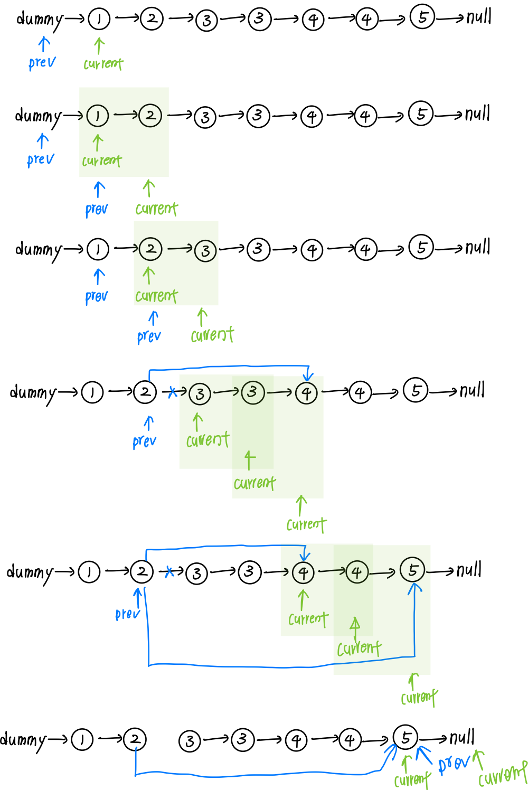

# 0082. Remove Duplicates from Sorted List II

* Difficulty: medium
* Link: https://leetcode.com/problems/remove-duplicates-from-sorted-list-ii/
* Topics: Linked-List, Multiple-Pointers

# Clarification

1. Check the inputs and outputs
    - INPUT: Linked List
    - OUTPUT: Linked List

# Naive Solution

### Thought Process

- current pointer and previous pointer
1. iterate the linked list
    - if current.val == current.next.val: prev.next=current.next
    - else
        - previous = previous.next
    - current = current.next
    
    
    
- Implement
    
    ```python
    **# Definition for singly-linked list.
    # class ListNode:
    #     def __init__(self, val=0, next=None):
    #         self.val = val
    #         self.next = next
    
    class Solution: 
        def deleteDuplicates(self, head: ListNode) -> ListNode:
            dummy = ListNode(0, head)
            prev = dummy
            current = dummy.next
            while current:
                if current.next and current.val == current.next.val:
                    while current.next and current.val == current.next.val:
                        current = current.next
                    prev.next = current.next
                else:
                    prev = prev.next
                current = current.next
            return dummy.next**
    ```
    

### Complexity

- Time complexity:$O(n)$
- Space complexity:$O(1)$

### Problems & Improvement

-