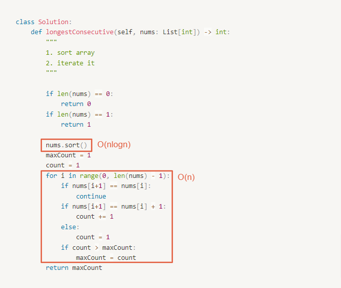

# 0128. Longest Consecutive Sequence

- Difficulty: medium
- Link: https://leetcode.com/problems/longest-consecutive-sequence/
- Topics: Array-String

# Clarification

1. Check the inputs and outputs
    - INPUT: List[int]
    - OUTPUT: integer
2. Check the main goal
    - time complexity $O(n)$

# Naive Solution

> in $O(nlogn)$
> 

### Thought Process

1. sort Array
2. iterate
    1. if 下一個 = 當前 + 1：count ++
    2. if 下一個 = 當前：往下一個 loop
    3. else：
        - 比對 maxCount 與 count，更新 maxCount
        - 將 count 重置回 1
- Implement
    
    ```python
    class Solution:
        def longestConsecutive(self, nums: List[int]) -> int:
            """
            1. sort array
            2. iterate it
            """
            
            if len(nums) == 0:
                return 0
            if len(nums) == 1:
                return 1
            
            nums.sort()        
            maxCount = 1
            count = 1
            for i in range(0, len(nums) - 1):
                if nums[i+1] == nums[i]:
                    continue
                if nums[i+1] == nums[i] + 1:
                    count += 1
                else:
                    count = 1
                if count > maxCount:
                    maxCount = count
            return maxCount
    ```
    

### Complexity

- Time complexity: $O(nlogn)$
    
    
    
- Space complexity:$O(1)$

### Problems & Improvement

- time complexity $O(n)$

# Improvement

> $O(n)$
> 

### Thought Process

1. use a set
2. iterate the array
    1. 該個 num 是否為 sequence 的起始點 ( num - 1 是否在 set 之中)
        
        [為起始點 (num - 1不在set中)]
        
        - 紀錄新的 sequence
        - 並向後尋找，後面的值是否在 set 之中
        
        [非起始點 (num - 1 在 set 中)]： continue
        
3. 計算每個 sequence 的數量
4. 回傳最長者
- Implement
    
    ```python
    class Solution:
        def longestConsecutive(self, nums: List[int]) -> int:
            """
            1. use a set
            2. iterate the array
                1. 該個 num 是否為 sequence 的起始點 ( num - 1 是否在 set 之中)
    
                    [為起始點 (num - 1不在set中)]
    
                    - 紀錄新的 sequence
                    - 並向後尋找，後面的值是否在 set 之中
    
                    [非起始點 (num - 1 在 set 中)]： continue
    
            3. 計算每個 sequence 的數量
            4. 回傳最長者
            """
            numSet = set(nums)
            sequence = []
            for num in numSet:
                if num - 1 in numSet: continue
                newSequence = []
                newSequence.append(num)
                nextNum = num + 1
                while nextNum in numSet:
                    newSequence.append(nextNum)
                    nextNum += 1
                sequence.append(newSequence)
            
            maxCount = 0
            for i in range(len(sequence)):
                if len(sequence[i]) > maxCount:
                    maxCount = len(sequence[i])
            
            return maxCount
    ```
    

### Complexity

- Time complexity: $O(n)$
    
    
    
- Space complexity: $O(n)$
    
    
    

# Check special cases, check error

- 只需要記住數量，不需要記得實際數字，所以可以不用記 sequence
    - Space Complexity: $O(1)$
    - implement
        
        ```python
        class Solution:
            def longestConsecutive(self, nums: List[int]) -> int:
                """
                1. use a set
                2. iterate the array
                    1. 該個 num 是否為 sequence 的起始點 ( num - 1 是否在 set 之中)
        
                        [為起始點 (num - 1不在set中)]
                        
                        - 並向後尋找，後面的值是否在 set 之中
                        - 記住找到多長
                        - 比較當前最長
        
                        [非起始點 (num - 1 在 set 中)]： continue
        
                4. 回傳最長者
                """
                numSet = set(nums)
                maxCount = 0
                for num in numSet:
                    if num - 1 in numSet: continue
                    nextNum = num + 1
                    while nextNum in numSet:
                        nextNum += 1
                    count = nextNum - num
                    maxCount = max(maxCount, count)
                return maxCount
        ```
        
- 算 nextNum 時就像是在加長度了，所以不用多一個變數去存 nextNum
    
    ```python
    class Solution:
        def longestConsecutive(self, nums: List[int]) -> int:
            numSet = set(nums)
            longest = 0
            for num in numSet:
                if num - 1 in numSet: continue
                length = 0
                while num + length in numSet:
                    length += 1
                longest = max(longest, length)
            return longest
    ```
    

# Note

- [Leetcode 128 - LONGEST CONSECUTIVE SEQUENCE](https://www.youtube.com/watch?v=P6RZZMu_maU)