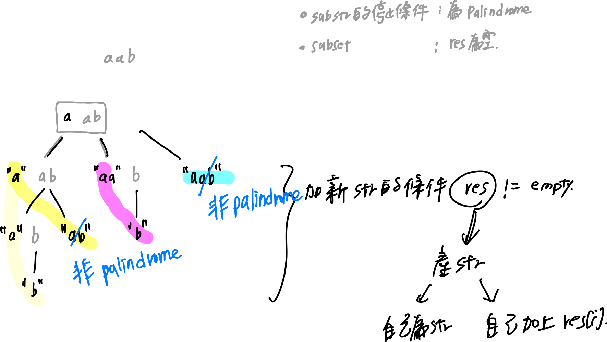

# 0131. Palindrome Partitioning

* Difficulty: medium
* Link: https://leetcode.com/problems/palindrome-partitioning/
* Topics: Backtracking

# Clarification

1. Check the inputs and outputs
    - INPUT: String
    - OUTPUT: List[List[String]]

# Naive Solution

### Thought Process

- 停止條件
    - len(res) == 0
- 非停止條件
    - substr = res[:i+1]
    - if substr is palindrome
        - backtrack
            - subset = subset + substr
            - res = res[i+1:]
    
    
    
    
    
- Implement
    
    ```python
    class Solution:
        def partition(self, s: str) -> List[List[str]]:
            result = []
            chars = list(s)
            def isPalindrome(substr):
                if len(substr) == 1:
                    return True
                forward_idx = 0
                backward_idx = len(substr) - 1
                while forward_idx < backward_idx:
                    if substr[forward_idx] != substr[backward_idx]:
                        return False
                    forward_idx += 1
                    backward_idx -=1
                return True
                        
            def backtrack(subset, res):
                if len(res) == 0:
                    return result.append(subset)
                for idx in range(len(res)):
                    substr = "".join(res[:idx+1])
                    if isPalindrome(substr):
                        backtrack(subset + [substr], res[idx+1:])
                
            backtrack([],chars)
            return result
    ```
    
    - 額外需準備的空間：string 長度的空間

### Complexity

- Time complexity: $O(N^N)$ ?!!!
    
    
    
    - 每個 backtrack 需要呼叫 len(res) 次 的 backtrack
    - N * (res - 1 次 backtrack)
        
        
        
        ```python
        len of input string = 3
        call backtrack = 6
        loop time = 7
        
        ==== backtrack ==== 1
        []
        ['a', 'a', 'b']
        ---- forloop -- 1 -- idx:0 ---- a
        ==== backtrack ==== 2
        ['a']
        ['a', 'b']
        ---- forloop -- 2 -- idx:0 ---- a
        ==== backtrack ==== 3
        ['a', 'a']
        ['b']
        ---- forloop -- 3 -- idx:0 ---- b
        ==== backtrack ==== 4
        ['a', 'a', 'b']
        []
        ---- forloop -- 4 -- idx:1 ---- ab
        ---- forloop -- 5 -- idx:1 ---- aa
        ==== backtrack ==== 5
        ['aa']
        ['b']
        ---- forloop -- 6 -- idx:0 ---- b
        ==== backtrack ==== 6
        ['aa', 'b']
        []
        ---- forloop -- 7 -- idx:2 ---- aab
        ```
        
- Space complexity: $O(N)$
    - N : len(input string)

### Problems & Improvement

- isPalindrome 的 function
    - [::-1] 順序相反操作
        - substr[::-1] 把整個 string 反過來
        
        ```python
        
        def isPalindrome(substr):
                    return substr == substr[::-1]
        ```