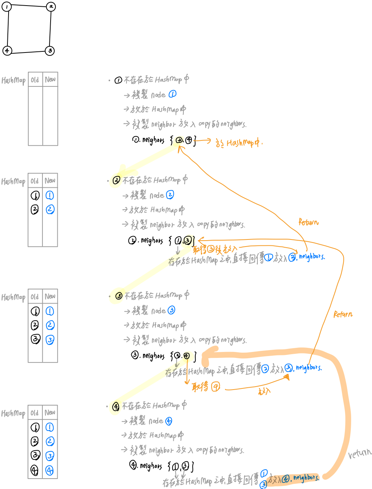

# 0133. Clone Graph


* Difficulty: medium
* Link: https://leetcode.com/problems/clone-graph/
* Topics: DFS-BFS, Graph, HashSet-HashMap
* highlight: 利用 HashMap 存新舊 node

# Clarification

1. Check the inputs and outputs
    - INPUT: node
    - OUTPUT: node

# Solution (DFS Recursive)

### Thought Process

- 利用 hashmap 存放新舊 node 之對照
- 使用 DFS 遍歷 node (遇到 neighbors 就往下 clone)
- 當 node 不存在於 hashmap 之中
    1. 複製此 node 並放於 hashmap 之中
    2. 複製相鄰 node 放置於 neighbors



- Implement
    
    ```python
    """
    # Definition for a Node.
    class Node:
        def __init__(self, val = 0, neighbors = None):
            self.val = val
            self.neighbors = neighbors if neighbors is not None else []
    """
    
    class Solution:
        def cloneGraph(self, node: 'Node') -> 'Node':
            oldNewMap = {}
            if not node:
                return None
            def cloneNode(node):
                if oldNewMap.get(node) is None:
                    copyNode = Node(node.val)
    								# 要先將 copyNode 放回 HashMap 之中，否則會無限循環
                    oldNewMap[node] = copyNode
                    for nei in node.neighbors:
                        copyNode.neighbors.append(cloneNode(nei))
                    return copyNode
                else:
                    return oldNewMap[node]
            return cloneNode(node)
    ```
    

### Complexity

- Time complexity:$O(V+E)$
    - 每個 node 以及每條 edge 都看過
- Space complexity:$O(V+E)$

### Problems & Improvement

- Clean Code
    - 若存在於 hashmap 之中先 Return
    - 將 clone node 提出為 function
- Implement
    
    ```python
    """
    # Definition for a Node.
    class Node:
        def __init__(self, val = 0, neighbors = None):
            self.val = val
            self.neighbors = neighbors if neighbors is not None else []
    """
    
    class Solution:
        oldNewMap = {}
        def cloneGraph(self, node: 'Node') -> 'Node':
            if not node:
                return None
            return self.cloneNode(node)
        
        def cloneNode(self, node):
            if node in self.oldNewMap:
                return self.oldNewMap[node]
            copyNode = Node(node.val)
            self.oldNewMap[node] = copyNode
            for nei in node.neighbors:
                copyNode.neighbors.append(self.cloneNode(nei))
            return copyNode
    ```
    

# Solution (DFS & BFS iteratively)

### Thought Process

- 利用 hashmap 存放新舊 node 之對照
- 使用 DFS 遍歷 node (使用 stack) / 若是 BFS 則使用 queue
    - 複製相鄰 node 放置於 neighbors
        - 當 node 不存在於 hashmap 之中
            1. 複製此 node 並放於 hashmap 之中
            2. 將此 node 放入 stack/queue 之中 (只看還沒放入 hashmap 之中的 node)


- Implement
    
    ```python
    """
    # Definition for a Node.
    class Node:
        def __init__(self, val = 0, neighbors = None):
            self.val = val
            self.neighbors = neighbors if neighbors is not None else []
    """
    
    class Solution:
        def cloneGraph(self, node: 'Node') -> 'Node':
            if not node:
                return None
            oldNewMap = {node: Node(node.val)}
            stack = [node]
            while stack:
                current = stack.pop()
                for nei in current.neighbors:
                    if nei not in oldNewMap:
                        oldNewMap[nei] = Node(nei.val)
                        stack.append(nei)
                    oldNewMap[current].neighbors.append(oldNewMap[nei])           
            return oldNewMap[node]
    ```
    

# Note

- iterative 的方式
    - 先將空間位址 new 出來
    - 後續再慢慢補上 neighbors 的東西
- recursive 的方式
    - 當下直接 recursive 下去，直接將 neighbors 完整的複製
- **[Clone Graph - Depth First Search - Leetcode 133](https://www.youtube.com/watch?v=mQeF6bN8hMk)**
- ****[Python solutions (BFS, DFS iteratively, DFS recursively).](https://leetcode.com/problems/clone-graph/discuss/42314/Python-solutions-(BFS-DFS-iteratively-DFS-recursively).)****