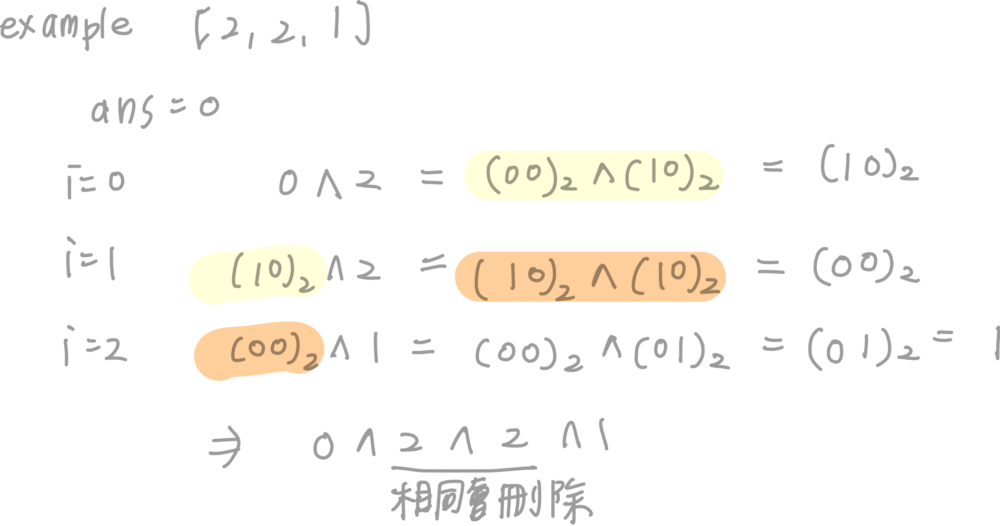

# 0136. Single Number

- Difficulty: easy
- Link: https://leetcode.com/problems/single-number/
- Topics: Array-String, Bitwise-Manipulation
- 
# Clarification

1. Check the inputs and outputs
    - INPUT: List[int]
    - OUTPUT: integer
2. Check the main goal
    - time complexity → $O(n)$
    - space complexity → $O(1)$

# Naive Solution

### Thought Process

1. 運用 XOR 的特性，儲存「這個數字是否出現過」
    1. 兩個不同會給 1
    2. 兩個同的會給 0
    
    原本的東西內如果沒有 n ，做 XOR 就會變成有 n
    原本的東西內如果有 n ，做 XOR 就會刪掉 n
    
    ```python
    0 ^ 1 ^ 2 ^ 3
    = ((0 ^ 1) ^ 2) ^ 3
    ```
    
- Implement
    
    ```python
    class Solution:
        def singleNumber(self, nums: List[int]) -> int:
            """
            運用 XOR 的特性，儲存「這個數字是否出現過」
            """
            ans = 0
            for num in nums:
                ans ^= num
            return  ans
    ```
    
    
    

### Complexity

- Time complexity: $O(n)$
- Space complexity:$O(1)$

### Problems & Improvement

- 

# Improvement

### Thought Process

1. 
- Implement
    
    ```python
    
    ```
    

### Complexity

- Time complexity:
- Space complexity:

# Check special cases, check error

- 

# Note

- Bit Manipulation
    - **[Basics of Bit Manipulation](https://www.hackerearth.com/practice/basic-programming/bit-manipulation/basics-of-bit-manipulation/tutorial/)**
    - **[【從面試題學邏輯-11】如何在一堆出現兩次的數中找到不重複的那位仁兄？](https://ithelp.ithome.com.tw/articles/10238714)**