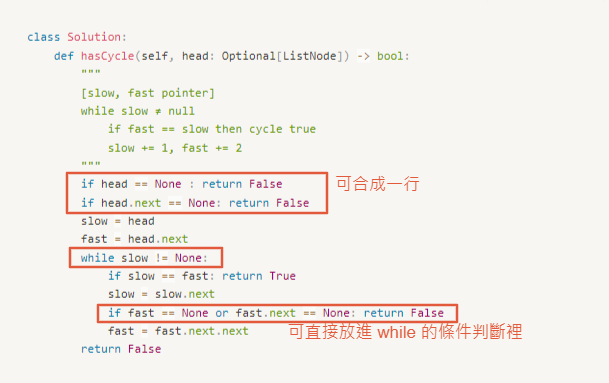

# 0141. Linked List Cycle

- Difficulty: easy
- Link: https://leetcode.com/problems/linked-list-cycle/
- Topics: Linked-List, Multiple-Pointers

# Clarification

1. Check the inputs and outputs
    - INPUT: Optional[ListNode]
    - OUTPUT: boolean
2. Check the main goal
    - linked list cycle detection

# Naive Solution

### Thought Process

[slow, fast pointer]

1. while slow ≠ null
    1. if fast == slow then cycle true
    - slow += 1, fast += 2
- Implement
    
    ```python
    class Solution:
        def hasCycle(self, head: Optional[ListNode]) -> bool:
            """
            [slow, fast pointer]
            while slow ≠ null
                if fast == slow then cycle true
                slow += 1, fast += 2
            """
            if head == None : return False
            if head.next == None: return False
            slow = head
            fast = head.next
            while slow != None:
                if slow == fast: return True
                slow = slow.next
                if fast == None or fast.next == None: return False
                fast = fast.next.next
            return False
    ```
    

### Complexity

- Time complexity: $O(n)$
- Space complexity:$O(1)$

### Problems & Improvement

- 程式碼可以更簡潔易懂
    
    
    

# Improvement

### Thought Process

1. 
- Implement
    
    ```python
    # Definition for singly-linked list.
    # class ListNode:
    #     def __init__(self, x):
    #         self.val = x
    #         self.next = None
    
    class Solution:
        def hasCycle(self, head: Optional[ListNode]) -> bool:
            """
            [slow, fast pointer]
            while fast ≠ null and fast.next ≠ null
                if fast == slow then cycle true
                slow += 1, fast += 2
            """
            slow = head
            fast = head
            while fast and fast.next:
                slow = slow.next
                fast = fast.next.next
                if slow == fast: return True
            return False
    ```
    

### Complexity

- Time complexity: $O(n)$
    
    
    
- Space complexity:$O(1)$

# Check special cases, check error

- 

# Note