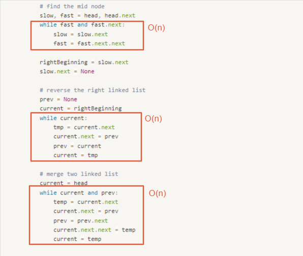

# 0143. Reorder List

* Difficulty: medium
* Link: https://leetcode.com/problems/reorder-list/
* Topics: Linked-List, Multiple-Pointers

# Clarification

1. Check the inputs and outputs
    - INPUT: Linked List
    - OUTPUT: void

# Naive Solution

### Thought Process

1. find middle node
2. reverse the linked list from middle node to the tail
3. connect the left linked list and the reverse right one
- Implement
    
    ```python
    # Definition for singly-linked list.
    # class ListNode:
    #     def __init__(self, val=0, next=None):
    #         self.val = val
    #         self.next = next
    class Solution:
        def reorderList(self, head: Optional[ListNode]) -> None:
            """
            Do not return anything, modify head in-place instead.
            """
            """
            1. find middle node
            2. reverse the linked list from middle node to the tail
            3. connect the left linked list and the reverse right one
            """
            
            # find the mid node
            slow, fast = head, head.next
            while fast and fast.next:
                slow = slow.next
                fast = fast.next.next
            
            rightBeginning = slow.next
            slow.next = None
                
            # reverse the right linked list
            prev = None
            current = rightBeginning
            while current:
                tmp = current.next
                current.next = prev
                prev = current
                current = tmp
            
            # merge two linked list
            current = head
            while current and prev:
                temp = current.next
                current.next = prev
                prev = prev.next
                current.next.next = temp
                current = temp
    ```
    

### Complexity

- Time complexity:$O(n)$
    
    
    
- Space complexity:$O(1)$

### Problems & Improvement

<aside>
💡 解釋該解法的問題、可以往哪個方向改善 (一次改善一個問題)

- 瓶頸點在哪裡
- 哪些部分是不需要的
</aside>

- 將功能性包成 function
    
    ```python
    # Definition for singly-linked list.
    # class ListNode:
    #     def __init__(self, val=0, next=None):
    #         self.val = val
    #         self.next = next
    class Solution:
        def reorderList(self, head: Optional[ListNode]) -> None:
            """
            Do not return anything, modify head in-place instead.
            """
            """
            1. find middle node
            2. reverse the linked list from middle node to the tail
            3. connect the left linked list and the reverse right one
            """
            
            # find the mid node
            leftEnd = self.findleftEnd(head)
            rightBeginning = leftEnd.next
            leftEnd.next = None
                
            # reverse the right linked list
            right = self.reverseList(rightBeginning)
            
            # merge two linked list
            self.mergeTwoList(head, right)
                
        def findleftEnd(self, head):
            slow, fast = head, head.next
            while fast and fast.next:
                slow = slow.next
                fast = fast.next.next
            return slow
    
        def reverseList(self, head):
            prev = None
            current = head
            while current:
                tmp = current.next
                current.next = prev
                prev = current
                current = tmp
            return prev
    
    		def mergeTwoList(self, left, right):
            while left and right:
                temp = left.next
                left.next = right
                right = right.next
                left.next.next = temp
                left = temp
    ```