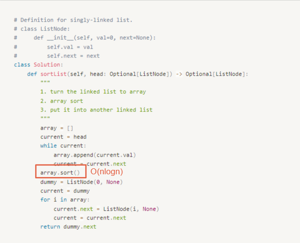

# 0148. Sort List

* Difficulty: medium
* Link: https://leetcode.com/problems/sort-list/
* Topics: Linked-List, Sort, Divide-and-Conquer

# Clarification

1. Check the inputs and outputs
    - INPUT: Linked List
    - OUTPUT: Linked List

# Naive Solution

### Thought Process

1. turn the linked list to array
2. array sort
3. put it into another linked list
- Implement
    
    ```python
    # Definition for singly-linked list.
    # class ListNode:
    #     def __init__(self, val=0, next=None):
    #         self.val = val
    #         self.next = next
    class Solution:
        def sortList(self, head: Optional[ListNode]) -> Optional[ListNode]:
            """
            1. turn the linked list to array
            2. array sort
            3. put it into another linked list
            """
            array = []
            current = head
            while current:
                array.append(current.val)
                current = current.next
            array.sort()
            dummy = ListNode(0, None)
            current = dummy
            for i in array:
                current.next = ListNode(i, None)
                current = current.next
            return dummy.next
    ```
    

### Complexity

- Time complexity:$O(nlogn)$
    
    
    
- Space complexity:$O(n)$
    
    
    

### Problems & Improvement

- **Follow up:**
    - Can you sort the linked list in `O(n logn)` time
    - `O(1)` memory (i.e. constant space)?

# Improvement

### Thought Process

[Merge Sort (top down)]

1. split the array into two arrays from the mid node
    1. split until one node
2. merge the nodes


- Implement
    
    ```python
    # Definition for singly-linked list.
    # class ListNode:
    #     def __init__(self, val=0, next=None):
    #         self.val = val
    #         self.next = next
    class Solution:
        def sortList(self, head: Optional[ListNode]) -> Optional[ListNode]:
            """
            merge sort
            """
            
            if not head or not head.next:
                return head
            
            # get mid node
            left = head
            leftEnd = self.getLeftEndNode(head)
            
            right = leftEnd.next
            leftEnd.next = None
            
            left = self.sortList(left)
            right = self.sortList(right)
            
            return self.mergeList(left, right)
        
        def getLeftEndNode(self, head):
            # 因為要取左邊的最後一個，所以 fast 從 head.next 開始
            slow, fast = head, head.next
            while fast and fast.next:
                slow = slow.next
                fast = fast.next.next
            return slow
        
        def mergeList(self, left, right):
            current = dummy = ListNode(0, None)
            while left and right:
                if left.val < right.val:
                    current.next = left
                    left = left.next
                else:
                    current.next = right
                    right = right.next
                current = current.next
            
            if left:
                current.next = left
            if right:
                current.next = right
            return dummy.next
    ```
    

### Complexity

- Time complexity:$O(nlogn)$
- Space complexity:$O(logn)$

# Note

- sort complexity
    
    
    
- [Sort List - Merge Sort - Leetcode 148](https://www.youtube.com/watch?v=TGveA1oFhrc)
- [花花酱 LeetCode 148. Sort List - 刷题找工作 EP211](https://www.youtube.com/watch?v=M1TwY0nsTZA)