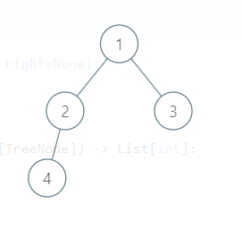

# 0199. Binary Tree Right Side View

Difficulty: medium
Link: https://leetcode.com/problems/binary-tree-right-side-view/
Topics: DFS-BFS

# Clarification

1. Check the inputs and outputs
    - INPUT: TreeNode
    - OUTPUT: List[int]

# Naive Solution

### Thought Process

1. BFS
2. 只記錄該層最右側的 node
- Implement
    
    ```python
    # Definition for a binary tree node.
    # class TreeNode:
    #     def __init__(self, val=0, left=None, right=None):
    #         self.val = val
    #         self.left = left
    #         self.right = right
    class Solution:
        def rightSideView(self, root: Optional[TreeNode]) -> List[int]:
            if not root:
                return []
            result = []
            q = collections.deque()
            q.append(root)
            
            while q:
                lenq = len(q)
                for i in range(lenq):
                    current = q.popleft()
                    if current.left:
                        q.append(current.left)
                    if current.right:
                        q.append(current.right)
                    if i == lenq - 1:
                        result.append(current.val)
            return result
    ```
    

### Complexity

- Time complexity: O(N)
- Space complexity: O(N)

### Problems & Improvement

- 是否可以直接看右邊的 node 即可
    - 需思考這種類型的問題，如果一開始只放 right 的 node 即會出現未考慮到 4 的問題
        
        
        
    - 使用 BFS 每一個 level 直接造訪是較 general 的方式