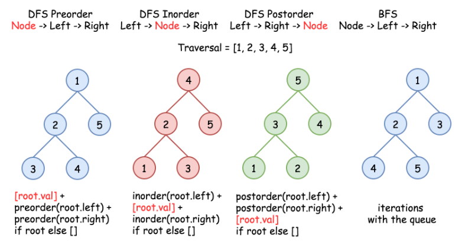

# 0230. Kth Smallest Element in a BST

* Difficulty: medium
* Link: https://leetcode.com/problems/kth-smallest-element-in-a-bst/
* Topics: DFS-BFS


# Clarification

1. Check the inputs and outputs

# Solution (DFS)

### Thought Process

- ****Recursive Inorder Traversal****
    
    
    
- Implement
    
    ```python
    # Definition for a binary tree node.
    # class TreeNode:
    #     def __init__(self, val=0, left=None, right=None):
    #         self.val = val
    #         self.left = left
    #         self.right = right
    class Solution:
        def kthSmallest(self, root: Optional[TreeNode], k: int) -> int:
            def inorder(root):
                if not root:
                    return []
                return inorder(root.left) + [root.val] + inorder(root.right)
            
            return inorder(root)[k-1]
    ```
    

### Complexity

- Time complexity: *O*(*N*) to build a traversal.
- Space complexity: *O*(*N*) to keep an inorder traversal.

# Note

- BST 的中序遍歷結果是有序的(升冪)