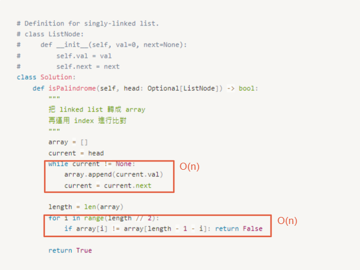

# 0234. Palindrome Linked List

* Difficulty: easy
* Link: https://leetcode.com/problems/palindrome-linked-list/
* Topics: Linked-List

# Clarification

1. Check the inputs and outputs
    - INPUT: Linked List
    - OUTPUT: boolean
2. Check the main goal

# Naive Solution

### Thought Process

1. 把 linked list 轉成 array
2. 再運用 index 進行比對
- Implement
    
    ```python
    # Definition for singly-linked list.
    # class ListNode:
    #     def __init__(self, val=0, next=None):
    #         self.val = val
    #         self.next = next
    class Solution:
        def isPalindrome(self, head: Optional[ListNode]) -> bool:
            """
            把 linked list 轉成 array
            再運用 index 進行比對
            """
            array = []
            current = head
            while current != None:
                array.append(current.val)
                current = current.next
            
            length = len(array)
            for i in range(length // 2):
                if array[i] != array[length - 1 - i]: return False
                
            return True
    ```
    

### Complexity

- Time complexity:$O(n)$
    
    
    
- Space complexity:$O(n)$
    
    
    

### Problems & Improvement

- **Follow up:** Could you do it in `O(n)` time and `O(1)` space?

# Improvement

### Thought Process

1. use slow, fast algorithm to find the middle node
2. reverse the list from middle to end
3. both go through from beginning and reverse list
    
    if all node value is the same: true
    
    else: false
    
- Implement
    
    ```python
    # Definition for singly-linked list.
    # class ListNode:
    #     def __init__(self, val=0, next=None):
    #         self.val = val
    #         self.next = next
    class Solution:
        def isPalindrome(self, head: Optional[ListNode]) -> bool:
            """
            1. use slow, fast algorithm to find the middle node
            2. reverse the list from middle to end
            3. both go through from beginning and reverse list
                if all node value is the same: true
                else: false
            """
            
            # find middle node
            slow = head
            fast = head
            while fast and fast.next:
                slow = slow.next
                fast = fast.next.next
            
            # reverse from middle to tail
            prev = None
            while slow:
                tmp = slow.next
                slow.next = prev
                prev = slow
                slow = tmp
            
            # check whether palindrome
            left = head
            right = prev
            while right:
                if left.val != right.val:
                    return False
                left = left.next
                right = right.next
            return True
    ```
    

### Complexity

- Time complexity:$O(n)$
- Space complexity:$O(1)$

# Check special cases, check error

- 

# Note

- Reverse Linked List
    
    
    
- [Palindrome Linked List - Leetcode 234 - Python](https://www.youtube.com/watch?v=yOzXms1J6Nk)