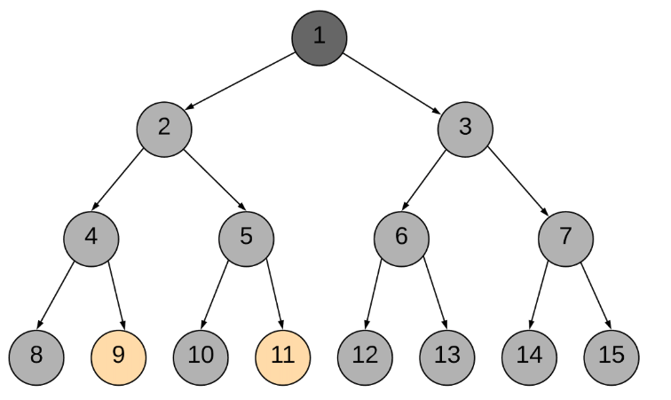

# 0236. Lowest Common Ancestor of a Binary Tree

Difficulty: medium
Link: https://leetcode.com/problems/lowest-common-ancestor-of-a-binary-tree/
highlight: 紀錄是否在該個子樹內
Topics: DFS-BFS

# Clarification

1. Check the inputs and outputs

# Solution

### Thought Process

- Recursive [[ref-leetcode-solution]](https://leetcode.com/problems/lowest-common-ancestor-of-a-binary-tree/solution/)
    - 條件
        - current == null: return False
        - else return mid or left or right
            - mid = current == q or q
            - left = dfs(root.left)
            - right = dfs(root.right)
    - 若 mid , left, right 有兩個 == True
        - ⇒ 這個node 就是 LCA
    
    
    
    
    
    
    
    
    
    
    
    
    
    
    
    
    
    
    
- Implement
    
    ```python
    # Definition for a binary tree node.
    # class TreeNode:
    #     def __init__(self, x):
    #         self.val = x
    #         self.left = None
    #         self.right = None
    
    class Solution:
        def __init__(self):
            self.ans = None
        def lowestCommonAncestor(self, root: 'TreeNode', p: 'TreeNode', q: 'TreeNode') -> 'TreeNode':
            
            def dfs(current):
                
                if not current:
                    return False
                
                left = dfs(current.left)
                right = dfs(current.right)
                mid = False
                
                if current == p or current == q:
                    mid = True
                
                if mid + left + right >= 2:
                    self.ans = current
                
                return mid or left or right
            
            dfs(root)
            return self.ans
    ```
    

### Complexity

- Time complexity: O(N)
    - N: number of nodes in binary tree
    - search all nodes
- Space complexity: O(N)
    - recursion stack
    - skewed binary tree