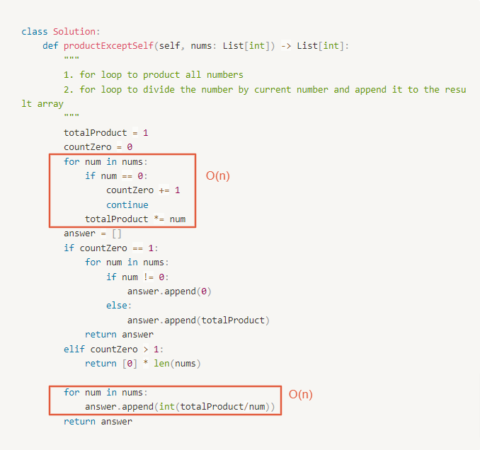

# 0238. Product of Array Except Self

- Difficulty: medium
- Link: https://leetcode.com/problems/product-of-array-except-self/
- Topics: Array-String

# Clarification

1. Check the inputs and outputs
    - INPUT: List[int]
    - OUTPUT: List[int]
2. Check the main goal
    - Time complexity $O(n)$
    - without using the division operation.

# Naive Solution

### Thought Process

1. for loop to product all numbers
2. for loop to divide the number by current number and append it to the result array
- Implement
    
    ```python
    class Solution:
        def productExceptSelf(self, nums: List[int]) -> List[int]:
            """
            1. for loop to product all numbers
            2. for loop to divide the number by current number and append it to the result array
            """
            totalProduct = 1
            countZero = 0
            for num in nums:
                if num == 0:
                    countZero += 1
                    continue
                totalProduct *= num
            answer = []
            if countZero == 1:
                for num in nums:
                    if num != 0:
                        answer.append(0)
                    else:
                        answer.append(totalProduct)
                return answer
            elif countZero > 1:
                return [0] * len(nums)
            
            for num in nums:
                answer.append(int(totalProduct/num))
            return answer
    ```
    

### Complexity

- Time complexity: $O(n)$
    
    
    
- Space complexity: $O(n)$
    - the result array

### Problems & Improvement

- !! how to solve without using the division operation. !!

# Improvement

### Thought Process

1. 不乘到自己的方式：
    - 先把自己左邊的數乘積 forloop to store the product of the left hand side
    - 再把自己右邊的數乘積 forloop to product the result of left hand side and the products of right hand side
    
    
    
- Implement
    
    ```python
    class Solution:
        def productExceptSelf(self, nums: List[int]) -> List[int]:
            """
            - 先把自己左邊的數乘積 forloop to store the product of the left hand side
            - 再把自己右邊的數乘積 forloop to product the result of left hand side and the products of right hand side
            """
            
            product = 1
            result = []
            for i in range(0,len(nums)):
                result.append(product)
                product *= nums[i]
            
            product = 1
            for i in range(len(nums) - 1, -1, -1):
                result[i] *= product
                product *= nums[i]
                
            return result
    ```
    

### Complexity

- Time complexity: $O(n)$
    
    
    
- Space complexity: $O(n)$ or $O(1)$
    - depends on whether the result array is considered in the space complexity analysis

# Check special cases, check error

- 第二個方法就不需要特別判斷 0 的存在

# Note

- **[[Attention🛑🛑] No One Going to Explain like this](https://leetcode.com/problems/product-of-array-except-self/discuss/1610450/Attention-No-One-Going-to-Explain-like-this)**