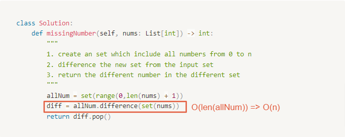

# 0268. Missing Number

Difficulty: easy
Link: https://leetcode.com/problems/missing-number/
Topics: Array-String

# Clarification

1. Check the inputs and outputs
    - INPUT: list[int]
    - OUTPUT: int
2. Check the main goal
    - find the missing value

# Naive Solution

<aside>
💡 從最簡單的方法開始 easy solution → only speak out

</aside>

### Thought Process

1. create an set which include all numbers from 0 to n
2. difference the new set from the input set
3. return the different number in the different set
- Implement
    
    ```python
    class Solution:
        def missingNumber(self, nums: List[int]) -> int:
            """
            1. create an set which include all numbers from 0 to n
            2. difference the new set from the input set
            3. return the different number in the different set
            """
            allNum = set(range(0,len(nums) + 1))
            diff = allNum.difference(set(nums))
            return diff.pop()
    ```
    

### Complexity

- Time complexity: $O(n)$
    - Runtime: 231 ms, faster than 23.17%
    
    
    
- Space complexity: $O(n)$
    - Memory Usage: 16.4 MB, less than 5.81%

### Problems & Improvement

<aside>
💡 解釋該解法的問題、可以往哪個方向改善 (一次改善一個問題)

- 瓶頸點在哪裡
- 哪些部分是不需要的
</aside>

- **Follow up:** Could you implement a solution using only `O(1)` extra space complexity and `O(n)` runtime complexity?

# Improvement

### Thought Process

1. calculate the sum for (0... len(nums)+1) (by gauss algortihm)
2. sum the input array
3. return the subtraction of these two number
- Implement
    
    ```python
    class Solution:
        def missingNumber(self, nums: List[int]) -> int:
            """
            1. calculate the sum for (0... len(nums)+1) (by gauss algortihm)
            2. sum the input array
            3. return the subtraction of these two number
            """
            allSum = (len(nums)+1)*len(nums)/2
            return int(allSum) - sum(nums)
    ```
    

### Complexity

- Time complexity: $O(n)$
    
    Runtime: 160 ms, faster than 41.23%
    
    
    
- Space complexity: $O(1)$
    
    Memory Usage: 15.4 MB, less than 50.84%
    

# Check special cases, check error

<aside>
💡 How you make break with the function

- 確認特別的 input 是否影響結果
- 確認可能已知的 error
- 有考慮到哪些 assumption
</aside>

- 

# Note

<aside>
💡 提出可以再改善的方式 (都可以用口語表達即可)

- 可針對特定語言擁有的 function (快速解決問題的方法)
    - 指出此方法的優點 eg. readable
- 精簡成新的 method
    - 一個 method 一件事情
</aside>

<aside>
💡 相關 Note 紀錄

</aside>

- [Time Complexity in Python](https://wiki.python.org/moin/TimeComplexity)