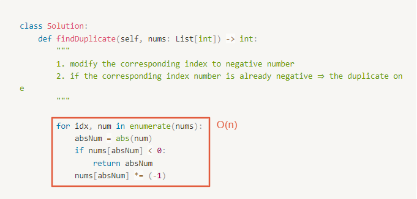

# 0287. Find the Duplicate Number

- Difficulty: medium
- Link: https://leetcode.com/problems/find-the-duplicate-number/
- Topics: Array-String, Binary-Search, Multiple-Pointers

# Clarification

1. Check the inputs and outputs
    - INPUT: List[int]
    - OUTPUT: integer
2. Check the main goal
    - Space complexity $O(1)$
    - All the integers in `nums` appear only **once** except for **precisely one integer** which appears **two or more** times.

# Naive Solution (Failed)

### Thought Process

1. using Gauss Algorithm $sum=(1+n)*(n)/2$
2. sum the array
3. subtract the summation of input array and the without one
- Implement
    
    ```python
    class Solution:
        def findDuplicate(self, nums: List[int]) -> int:
            """
            1. using Gauss Algorithm $sum=(1+n)*(n)/2$
            2. sum the array
            3. subtract the summation of input array and the without one
            """
            
            sumWithoutDuplicate = (1 + len(nums) - 1)*(len(nums) - 1)/2
            sum = 0
            for num in nums:
                sum += num
            return int(sum - sumWithoutDuplicate)
    ```
    

### Complexity

- Time complexity:$O(n)$
- Space complexity:$O(1)$

### Problems & Improvement

- There is only **one repeated number** in `nums`, return *this repeated number*.
    
    <aside>
    ⚠️ 一個 number 可以 repeat 很多次!!!
    
    </aside>
    
    - 因此，目前 Naive 的解法無法解決問題

# Naive Solution

### Thought Process

1. two for loop to check the numbers
- Implement
    
    ```python
    class Solution:
        def findDuplicate(self, nums: List[int]) -> int:
            """
            1. using Gauss Algorithm $sum=(1+n)*(n)/2$
            2. sum the array
            3. subtract the summation of input array and the without one
            """
            
            sumWithoutDuplicate = (1 + len(nums) - 1)*(len(nums) - 1)/2
            sum = 0
            for num in nums:
                sum += num
            return int(sum - sumWithoutDuplicate)
    ```
    

### Complexity

- Time complexity:$O(n^2)$
- Space complexity:$O(1)$

### Problems & Improvement

- Time Limit Exceeded

# Improvement

### Thought Process

1. modify the corresponding index to negative number
2. if the corresponding index number is already negative ⇒ the duplicate one
- Implement
    
    ```python
    class Solution:
        def findDuplicate(self, nums: List[int]) -> int:
            """
            1. modify the corresponding index to negative number
            2. if the corresponding index number is already negative ⇒ the duplicate one
            """
            
            for idx, num in enumerate(nums):
                absNum = abs(num)
                if nums[absNum] < 0:
                    return absNum
                nums[absNum] *= (-1)
    ```
    

### Complexity

- Time complexity:$O(n)$
    
    
    
- Space complexity:$O(1)$

### Problems & Improvement

- You must solve the problem **without** modifying the array `nums` and uses only constant extra space.

# Improvement (Binary Search)

### Thought Process

- 原理
    
    
    
- 運用此原理進行 Binary search 找出重複的值
    1. lowerBound = 1, upperBound= len(nums) - 1
    2. 當 lowerBound < upperBound
        1. 求出當前的中間點 mid : (lowerBound +upperBound) / 2
        2. 統計所有小於等於 mid 的個數
            - 若數量 ≤  mid 表示重複的數在 [mid + 1, upperBound] 之間 (lowerBound = mid+1)
            - 若數量 >  mid 表示重複的數在 [lowerBound ,  mid] 之間 (upperBound = mid)
    3. return lowerBound
- implement
    
    ```python
    class Solution:
        def findDuplicate(self, nums: List[int]) -> int:
            """
            1. lowerBound = 1, upperBound= len(nums) - 1
            2. 當 lowerBound <= upperBound
                1. 求出當前的中間點 mid : (lowerBound +upperBound) / 2
                2. 統計所有小於等於 mid 的個數
                    - 若數量 ≤  mid 表示重複的數在 [mid + 1, upperBound] 之間 (lowerBound = mid+1)
                    - 若數量 >  mid 表示重複的數在 [lowerBound ,  mid] 之間 (upperBound = mid)
            3. return lowerBound
            """
            
            lowerBound, upperBound = 1, len(nums) - 1
            while lowerBound < upperBound:
                mid = (lowerBound + upperBound) // 2
                count = 0
                for num in nums:
                    if num <= mid:
                        count += 1
                
                if count <= mid:
                    lowerBound = mid + 1
                else:
                    upperBound = mid
            return lowerBound
    ```
    

### Complexity

- Time complexity: $O(nlogn)$
- Space complexity:$O(1)$

### Problems & Improvement

- Can you solve the problem in linear runtime complexity?

## Improvement (Linked List Cycle Detection)

### Thought Process

- 原理
    
    
    
- Linked List Cycle Detection
    
    
    
- Find the entry point of the cycle
    
    
    
- implement
    
    ```python
    class Solution:
        def findDuplicate(self, nums: List[int]) -> int:
            """
            1. detect cycle
            2. find the entry point
            """
            slow = nums[0]
            fast = nums[nums[0]]
            while slow != fast:
                slow = nums[slow]
                fast = nums[nums[fast]]
            
            slow = 0
            while slow != fast:
                slow = nums[slow]
                fast = nums[fast]
            
            return slow
    ```
    

### Complexity

- Time complexity: $O(n)$
- Space complexity:$O(1)$

# Check special cases, check error

- 

# Note

- python 精簡 method
    - sum 內可使用條件
        - origin
            
            ```python
              count = 0
              for num in nums:
                  if num <= mid:
                      count += 1
            ```
            
        - improvement
            
            ```python
            count = sum(num <= mid for num in nums)
            ```
            
- [Leetcode 287 Find the Duplicate Number](https://www.youtube.com/watch?v=zQ6eAdtDeqg)
- **[LeetCode 287 Find the Duplicate Number (Python)](https://maxming0.github.io/2020/06/25/Find-the-Duplicate-Number/)**