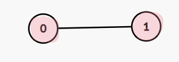

# 0310. Minimum Height Trees

* Difficulty: medium
* Link: https://leetcode.com/problems/minimum-height-trees/
* Topics: DFS-BFS, Topological-Sort
* highlight: 剝洋蔥，一層一層退去葉節點

# Clarification

1. Check the inputs and outputs
    - INPUT: List[List[int]]
    - OUTPUT: List[int]

# Naive Solution

### Thought Process

1. 建立一個 dict 紀錄每個 node 的 longest path
2. 對每個 node 進行 BFS，紀錄longest path level
3. 找出擁有最小 longest path level 的 node 放入 result array 中
- Implement
    
    ```python
    class Solution:
        def findMinHeightTrees(self, n: int, edges: List[List[int]]) -> List[int]:
            #1. 建立一個 dict 紀錄每個 node 的 longest path
            heightRecord = dict.fromkeys(range(n), 0)
            minDepth = n;
            
            # graph
            graph = [[] for i in range(n)]
            for n1, n2 in edges:
                graph[n1].append(n2)
                graph[n2].append(n1)
            
            def bfs(node):
                q = collections.deque()
                visited = set()
                visited.add(node)
                q.append(node)
                level = 0
                while q:
                    level += 1
                    if(level > minDepth):
                        return minDepth + 1
                    lenQ = len(q)
                    for i in range(lenQ):
                        current = q.popleft()
                        visited.add(current)
                        for e in graph[current]:
                            if e not in visited:
                                q.append(e)
                return level
            
            #2. 對每個 node 進行 BFS，紀錄longest path level
            for node in range(n):
                heightRecord[node] = bfs(node)
                if heightRecord[node] < minDepth:
                    minDepth = heightRecord[node]
                
            #3. 找出擁有最小 longest path level 的 node 放入 result array 中
            minval = min(heightRecord.values())
            res = [k for k, v in heightRecord.items() if v==minval]
            return res
    ```
    

### Complexity

- Time complexity: $O(V*(V+E))$
    - 所有節點都遍歷一次 O(V)
    - 每個節點遍歷一次為 O(V+E)
- Space complexity:

### Problems & Improvement

- Time Limit Exceeded
- Hint: How many MHTs can a graph have at most?
    - 2 個
    - MHT ：以 graph **最長路徑中間的節點**作為 root 的 tree
        - 最長路徑有**奇**數個節點：中間節點有 1 個
        - 最長路徑有**偶**數個節點：中間節點有 2 個
        
        Examples
        
        - N = 2
            
            
            
            Root 0: 0 → 1, height = 1
            
            Root 1: 1 → 0, height = 1
            
        - N = 3
            
            
            
            - Root 0: 0 → 1 → 2, height = 2
            - Root 1: 1 → 0, 1→ 2, height = 1
            - Root 2: 2 → 1 → 0, height = 2
        - N = 4
            
            
            
        - 往側邊長
            
            
            
        

# Improvement

### Thought Process

- 剝洋蔥法
    - 一層一層退去葉節點，剩下的一個或兩個節點即為所要求的最小高度樹的根節點
    - Examples
        - Leaf nodes: [0, 1, 2, 5]
            
            
            
            
            
        - Remove leaf nodes
            
            
            
            - graph 剩下兩個 node ⇒ 最小高度樹的根節點們
1. 建立 graph
2. 將葉節點放於 queue 中
3. 遍歷每個葉節點 i
    1. 將與葉節點 i 相鄰的節點 j，將 graph[j] 中的 i 移除
    2. 若 graph[j] 移除 i 後成為葉節點 (只剩一個相鄰的節點)，則加入 queue 之中
    3. ~~當 queue 內的數量 ≤ 2 時停止~~ → 當剩下的 node ≤ 2 時停止
4. return queue 內的 node
- Implement
    
    ```python
    class Solution:
        def findMinHeightTrees(self, n: int, edges: List[List[int]]) -> List[int]:
            
            if n == 1:
                return [0]
            
            #1. 建立 graph
            graph = [[] for i in range(n)]
            for n1, n2 in edges:
                graph[n1].append(n2)
                graph[n2].append(n1)
                
            #2. 將葉節點放於 queue 中
            q = collections.deque()
            for i in range(n):
                if len(graph[i]) == 1:
                    q.append(i)
    
            #3. 遍歷每個葉節點 i
                #a. 將與葉節點 i 相鄰的節點 j，將 graph[j] 中的 i 移除
                #b. 若 graph[j] 移除 i 後成為葉節點 (只剩一個相鄰的節點)，則加入 queue 之中
                #c. 當剩餘 node 的數量 ≤ 2 時停止
            while n > 2:
                lenQ = len(q)
                n -= lenQ
                for t in range(lenQ):
                    current = q.popleft()
                    for i in graph[current]:
                        graph[i].remove(current)
                        graph[current].remove(i)
                        if len(graph[i]) == 1:
                            q.append(i)
            return q
    ```
    

### Complexity

- Time complexity: $O(V+E)$
    - 建立 graph: O(E)
    - 將葉節點放於 queue 中: O(V)
    - 遍歷每個葉節點 i: O(V+E)
- Space complexity:

# Check special cases, check error

# Note

- **[[LeetCode] Minimum Height Trees 最小高度树](https://www.cnblogs.com/grandyang/p/5000291.html)**