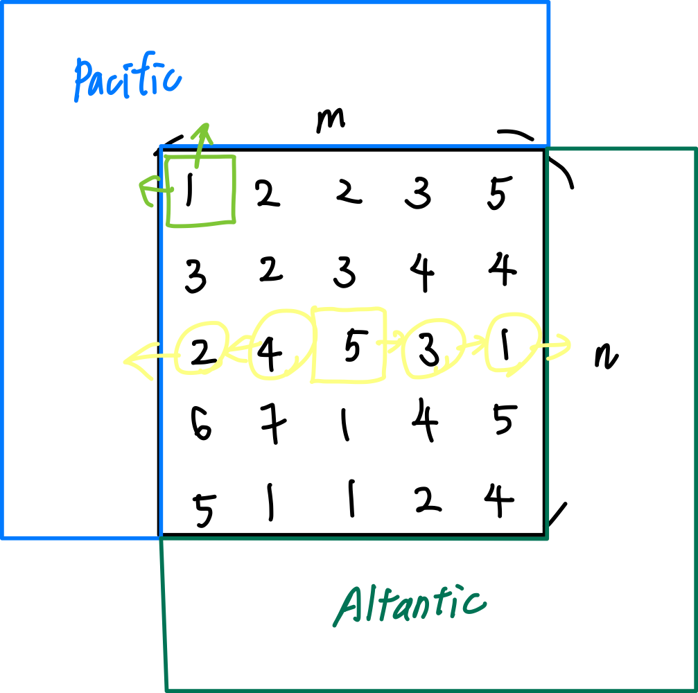

# 0417. Pacific Atlantic Water Flow

* Difficulty: medium
* Link: https://leetcode.com/problems/pacific-atlantic-water-flow/
* Topics: DFS-BFS
* highlight: 使用 visited 記錄方式，DFS

# Clarification

1. Check the inputs and outputs
    - INPUT: List[List[int]]
    - OUTPUT: List[List[int]]
- 該格的水能不能流到兩個海域 ⇒ 該格能不能走到兩個海域的邊界
    
    
    

# Naive Solution

### Thought Process

1. 每一格都去走 DFS / BFS 看是否能走到兩個邊界，可以的話，放入 result 之中
    
    
    
- Implement
    
    ```python
    class Solution:
        def pacificAtlantic(self, heights: List[List[int]]) -> List[List[int]]:
            result = []
            rows = len(heights)
            columns = len(heights[0])
            for r in range(rows):
                for c in range(columns):
                    if self.isGoBoth(heights, r, c):
                        result.append([r,c])
            return result
        
        def isGoBoth(self, heights, r, c):
            isPacific = False
            isAtlantic = False
            
            stack = [[r,c]]
            while stack:
                current = stack.pop()
                currentR = current[0]
                currentC = current[1]
                if currentR == 0 or currentC == 0:
                    isPacific = True
                else:
                    # north
                    if heights[currentR][currentC] >= heights[currentR - 1][currentC]:
                        stack.append([currentR - 1, currentC])
                    # west  
                    if heights[currentR][currentC] >= heights[currentR][currentC - 1]:
                        stack.append([currentR, currentC - 1])
    
                if currentR == (len(heights) - 1) or currentC ==(len(heights[0]) - 1):
                    isAtlantic = True
                else:
                    # south
                    if heights[currentR][currentC] >= heights[currentR + 1][currentC]:
                        stack.append([currentR + 1, currentC])
                    # east
                    if heights[currentR][currentC] >= heights[currentR][currentC + 1]:
                        stack.append([currentR, currentC + 1])
                if (isPacific and isAtlantic):
                    return True
    
            return (isPacific and isAtlantic)
    ```
    

### Complexity

- Time complexity:$O((M*N)^2)$
    - 共有 $M*N$ 個格
    - 每一格最多可能走 $M*N$ 遍格
- Space complexity:$O(M*N)$
    - Stack 最多存入所有 node

### Problems & Improvement

- Time Limit Exceeded
- 走太多次，是否可以減少搜尋的次數

# Improvement

### Thought Process

- 往回流的方式，只搜尋從邊界往上游找，流過的部分標記起來
    
    
    
1. 針對兩邊邊界往上游找，且找過的 node 就不找
2. 再遍歷所有node的標記，看是否兩個海域都流過
- Implement
    
    ```python
    class Solution:
        def pacificAtlantic(self, heights: List[List[int]]) -> List[List[int]]:
            result = []
            rows = len(heights)
            columns = len(heights[0])
            
            markPacific = [[False] * columns for i in range(rows)]
            markAtlantic = [[False] * columns for i in range(rows)]
            
            def dfs(row, column, mark):
                stack = [[row,column]]
                while stack:
                    current = stack.pop()
                    r = current[0]
                    c = current[1]
                    mark[r][c] = True
                    if r != 0 and heights[r][c] <= heights[r-1][c]:
                        if mark[r-1][c] is False:
                            stack.append([r-1,c])
                    if c != 0 and heights[r][c] <= heights[r][c-1]:
                        if mark[r][c-1] is False:
                            stack.append([r, c-1])
                    if r != rows-1 and heights[r][c] <= heights[r+1][c]:
                        if mark[r+1][c] is False:
                            stack.append([r+1, c])
                    if c != columns-1 and heights[r][c] <= heights[r][c+1]:
                        if mark[r][c+1] is False:
                            stack.append([r, c+1])
                return mark
                        
            
            # Pacific
            # r = 0
            # Atlantic
            # r = rows - 1
            for c in range(columns):
                markPacific = dfs(0, c, markPacific)
                markAtlantic = dfs(rows - 1, c, markAtlantic)
    
            # c = 0
            # c = columns - 1
            for r in range(rows):
                markPacific = dfs(r, 0, markPacific)
                markAtlantic = dfs(r, columns - 1, markAtlantic)
    
            # check all
            for r in range(rows):
                for c in range(columns):
                    if markPacific[r][c] and markAtlantic[r][c]:
                        result.append([r, c])
            return result
    ```
    

### Complexity

- Time complexity:$O(M*N)$
    - 因為走過的就不在放入 DFS 遍歷，所以最多只會每個 node 遍歷一次
- Space complexity:$O(M*N)$
    - 額外兩個 matrix 紀錄遍歷的過程

### Problems & Improvement

- 可以利用 set 取代 matrix 作為 mark 紀錄
    - Implement
        
        ```python
        class Solution:
            def pacificAtlantic(self, heights: List[List[int]]) -> List[List[int]]:
                result = []
                rows = len(heights)
                columns = len(heights[0])
                
                markPacific = set()
                markAtlantic = set()
                
                def dfs(row, column, mark):
                    stack = [[row,column]]
                    while stack:
                        current = stack.pop()
                        r = current[0]
                        c = current[1]
                        mark.add((r,c))
                        if r != 0 and heights[r][c] <= heights[r-1][c]:
                            if (r-1,c) not in mark:
                                stack.append([r-1,c])
                        if c != 0 and heights[r][c] <= heights[r][c-1]:
                            if (r,c-1) not in mark:
                                stack.append([r, c-1])
                        if r != rows-1 and heights[r][c] <= heights[r+1][c]:
                            if (r+1,c) not in mark:
                                stack.append([r+1, c])
                        if c != columns-1 and heights[r][c] <= heights[r][c+1]:
                            if (r,c+1) not in mark:
                                stack.append([r, c+1])
                    return mark
                            
                
                # Pacific
                # r = 0
                # Atlantic
                # r = rows - 1
                for c in range(columns):
                    markPacific = dfs(0, c, markPacific)
                    markAtlantic = dfs(rows - 1, c, markAtlantic)
        
                # c = 0
                # c = columns - 1
                for r in range(rows):
                    markPacific = dfs(r, 0, markPacific)
                    markAtlantic = dfs(r, columns - 1, markAtlantic)
        
                # check all
                for r in range(rows):
                    for c in range(columns):
                        if (r,c) in markPacific and (r,c) in markAtlantic:
                            result.append([r, c])
                return result
        ```
        
- 將考慮的四個方位統整起來，針對更動後的index進行判斷即可
    - Implement
        
        ```python
        class Solution:
            def pacificAtlantic(self, heights: List[List[int]]) -> List[List[int]]:
                result = []
                rows = len(heights)
                columns = len(heights[0])
                
                markPacific = set()
                markAtlantic = set()
                
                def dfs(row, column, mark):
                    stack = [[row,column]]
                    directions = [(-1, 0), (1, 0), (0, 1), (0, -1)]
                    while stack:
                        current = stack.pop()
                        r = current[0]
                        c = current[1]
                        mark.add((r,c))
                        for dx, dy in directions:
                            newR, newC = r + dx, c + dy
                            if 0 <= newR < rows and 0 <= newC < columns and (newR,newC) not in mark and heights[r][c] <= heights[newR][newC]:
                                stack.append([newR,newC])
                    return mark
                            
                
                # Pacific
                # r = 0
                # Atlantic
                # r = rows - 1
                for c in range(columns):
                    markPacific = dfs(0, c, markPacific)
                    markAtlantic = dfs(rows - 1, c, markAtlantic)
        
                # c = 0
                # c = columns - 1
                for r in range(rows):
                    markPacific = dfs(r, 0, markPacific)
                    markAtlantic = dfs(r, columns - 1, markAtlantic)
        
                # check all
                for r in range(rows):
                    for c in range(columns):
                        if (r,c) in markPacific and (r,c) in markAtlantic:
                            result.append([r, c])
                return result
        ```
        
- 使用 recursive 的 DFS
    - Implement
        
        ```python
        class Solution:
            def pacificAtlantic(self, heights: List[List[int]]) -> List[List[int]]:
                result = []
                rows = len(heights)
                columns = len(heights[0])
                directions = [(-1, 0), (1, 0), (0, 1), (0, -1)]
                markPacific = set()
                markAtlantic = set()
        
                def dfs(r, c, mark):
                    mark.add((r,c))
                    for dx, dy in directions:
                        newR, newC = r + dx, c + dy
                        if 0 <= newR < rows and 0 <= newC < columns and (newR,newC) not in mark and heights[r][c] <= heights[newR][newC]:
                            dfs(newR,newC,mark)
                            
                # Pacific
                # r = 0
                # Atlantic
                # r = rows - 1
                for c in range(columns):
                    dfs(0, c, markPacific)
                    dfs(rows - 1, c, markAtlantic)
        
                # c = 0
                # c = columns - 1
                for r in range(rows):
                    dfs(r, 0, markPacific)
                    dfs(r, columns - 1, markAtlantic)
        
                # check all
                for r in range(rows):
                    for c in range(columns):
                        if (r,c) in markPacific and (r,c) in markAtlantic:
                            result.append([r, c])
                return result
        ```
        

# Check special cases, check error

- 若為 empty matrix ⇒ 題目的 assumption 即排除此可能
    
    ```python
    m == heights.length
    n == heights[r].length
    1 <= m, n <= 200
    ```
    

# Note

- **[Pacific Atlantic Water Flow - Leetcode 417 - Python](https://www.youtube.com/watch?v=s-VkcjHqkGI)**
- ****[Easy understand DFS solution beat 97%](https://leetcode.com/problems/pacific-atlantic-water-flow/discuss/543988/Easy-understand-DFS-solution-beat-97)****