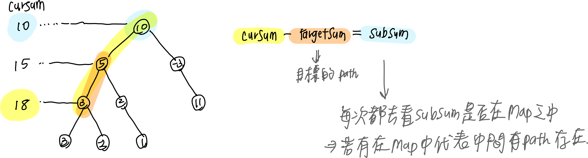

# 0437. Path Sum III

* Difficulty: medium
* Link: https://leetcode.com/problems/path-sum-iii/
* Topics: DFS-BFS
* highlight: 遍歷順序

# Clarification

1. Check the inputs and outputs

# Solution (DFS)

### Thought Process

- 每個點都當成一棵樹的 root
- Implement
    
    ```python
    
    ```
    

### Complexity

- Time complexity:
- Space complexity:

# Improvement (DFS + HashMap)

### Thought Process

- HashMap 紀錄前面路徑合出現過的次數
    
    
    
- Implement
    
    ```python
    # Definition for a binary tree node.
    # class TreeNode:
    #     def __init__(self, val=0, left=None, right=None):
    #         self.val = val
    #         self.left = left
    #         self.right = right
    class Solution:
        count = 0
        pathSumMap = {}
        pathSumMap[0]=1
        
        def pathSum(self, root: Optional[TreeNode], targetSum: int) -> int:
            
            if not root:
                return 0
                   
            def dfs(root, curSum):
                if not root:
                    return
                curSum += root.val
                
                # 計算路路徑長度差
                subPath = curSum - targetSum
                self.count += self.pathSumMap.get(subPath, 0)
                self.pathSumMap[curSum] = self.pathSumMap.get(curSum, 0) + 1
    
                dfs(root.left, curSum)
                dfs(root.right, curSum)
    
                # 換另一條路下去前，要把先前的路刪掉
                self.pathSumMap[curSum] = self.pathSumMap.get(curSum, 0) - 1
                curSum -= root.val
                
            dfs(root, 0)
            
            return self.count
    ```
    

### Complexity

- Time complexity:
- Space complexity:

# Note