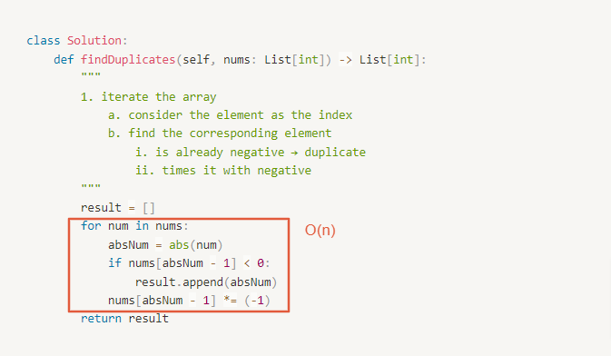

# 0442. Find All Duplicates in an Array

- Difficulty: medium
- Link: https://leetcode.com/problems/find-all-duplicates-in-an-array
- Topics: Array-String

# Clarification

1. Check the inputs and outputs
    - INPUT: List[int]
    - OUTPUT: List[int]
2. Check the main goal
    - return the duplicate numbers
    - time complexity $O(n)$
    - space complexity $O(1)$

# Naive Solution

### Thought Process

1. iterate the array
    1. consider the element as the index
    2. find the corresponding element 
        1. is already negative → duplicate
        2. times it with negative
- Implement
    
    ```python
    class Solution:
        def findDuplicates(self, nums: List[int]) -> List[int]:
            """
            1. iterate the array
                a. consider the element as the index
                b. find the corresponding element 
                    i. is already negative → duplicate
                    ii. times it with negative
            """
            result = []
            for num in nums:
                absNum = abs(num)
                if nums[absNum - 1] < 0:
                    result.append(absNum)
                nums[absNum - 1] *= (-1)
            return result
    ```
    

### Complexity

- Time complexity: $O(n)$
    
    
    
- Space complexity:$O(1)$