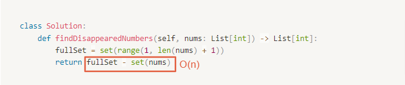

# 0448. Find All Numbers Disappeared in an Array

Difficulty: easy
Link: https://leetcode.com/problems/find-all-numbers-disappeared-in-an-array/
Topics: Array-String

# Clarification

1. Check the inputs and outputs
    - INPUT: List[int]
    - OUTPUT: List[int]
2. Check the main goal
    - find disappeared numbers

# Naive Solution

### Thought Process

1. a for loop for all numbers and check whether it is in the input array
- Implement
    
    ```python
    class Solution:
        def findDisappearedNumbers(self, nums: List[int]) -> List[int]:
            """
            a for loop for all numbers and check whether it is in the input array
            """
            resultList = []
            for num in range(1, len(nums) +1 ):
                if num in nums:
                    continue
                resultList.append(num)
            return resultList
    ```
    

### Complexity

- Time complexity: $O(n)$
- Space complexity: $O(n)$

### Problems & Improvement

- Time Limit Exceeded

# Improved Solution

### Thought Process

1. 使用兩個 set 相減
- Implement
    
    ```python
    class Solution:
        def findDisappearedNumbers(self, nums: List[int]) -> List[int]:
            fullSet = set(range(1, len(nums) + 1))
            return fullSet - set(nums)
    ```
    

### Complexity

- Time complexity: $O(n)$
    
    
    
- Space complexity: $O(n)$

### Problems & Improvement

- Could you do it without extra space and in O(*n*) runtime? You may assume the returned list does not count as extra space.

# Improved Solution

### Thought Process

1. iterate the input array
    - 將該個 number 對應 index 中的數字標記為 negative
    
    [FullSizeRender.mov](./FullSizeRender.mov)
    
- Implement
    
    ```python
    class Solution:
        def findDisappearedNumbers(self, nums: List[int]) -> List[int]:
            for num in nums:
                index = abs(num) - 1
                if nums[index] > 0:
                    nums[index] *= (-1)
            result = []
            for (idx, num) in enumerate(nums):
                if num > 0:
                    result.append(idx + 1)
            return result
    ```
    

# Check special cases, check error

- check whether 1≤ nums[i] ≤ n

# Notes

- **[Find All Numbers Disappeared in an Array](https://medium.com/@saurav.agg19/find-all-numbers-disappeared-in-an-array-c6a01393909)**