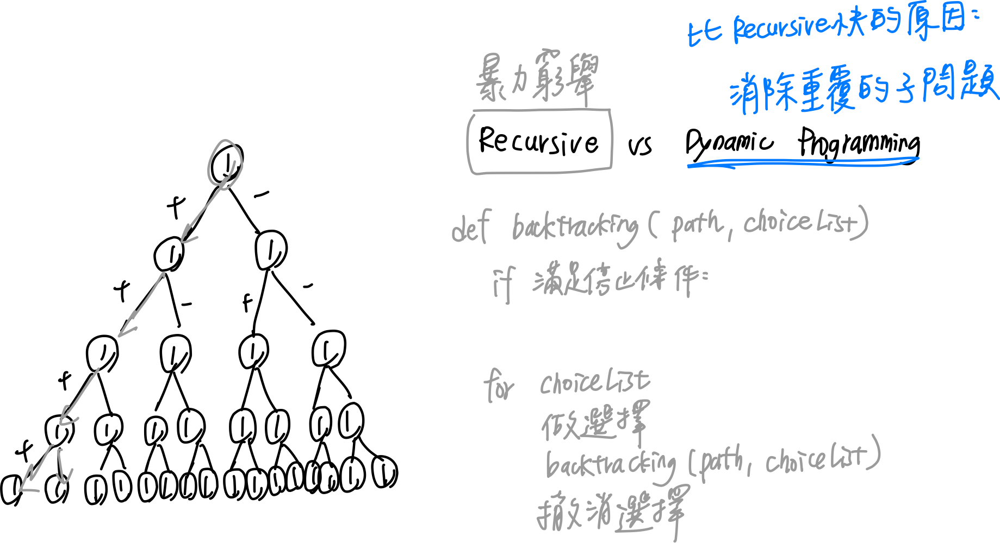
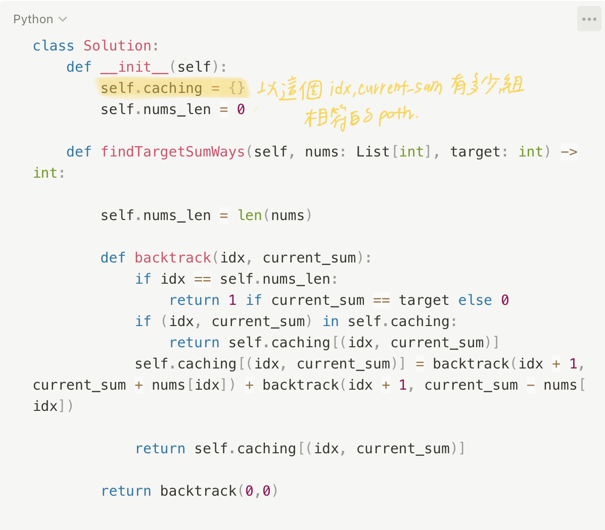

# 0494. Target Sum

* Difficulty: medium
* Link: https://leetcode.com/problems/target-sum/
* Topics: DFS-BFS

# Clarification

1. Check the inputs and outputs

# Solution (****Brute Force - Recursive)****

### Thought Process

- go through the array like an binary tree
- left child as “+”
- right child as “-”
- traverse by DFS and calculate the summation of the path
    
    
    
    
    
- Implement
    
    ```python
    class Solution:
        def __init__(self):
            self.result = 0
            self.nums_len = 0
        
        def findTargetSumWays(self, nums: List[int], target: int) -> int:
            
            self.nums_len = len(nums)
            
            def traverse_sum(current_sum, idx):
                if idx == self.nums_len:
                    if current_sum == target:
                        self.result += 1            
                    return
                traverse_sum(current_sum + nums[idx], idx + 1)
                traverse_sum(current_sum - nums[idx], idx + 1)
                
            traverse_sum(0, 0)
            return self.result
    ```
    

### Complexity

- Time complexity: $O(2^n)$
    - n: size of nums array
- Space complexity:$O(n)$
    - depth of the recursion tree

### Problems & Improvement

- time limit exceeded

# Improvement (Dynamic Programming)

### Thought Process

1. 利用 caching 紀錄相同 index 的相同 total
    
    
    
- Implement
    
    
    

### Complexity

- Time complexity: O(n * t)
    
    
    
- Space complexity: O(n * t)

# Check special cases, check error

- 

# Note

- [Target sum [neetcode]](https://www.youtube.com/watch?v=g0npyaQtAQM)