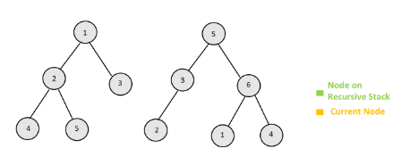

# 0617. Merge Two Binary Trees

* Difficulty: easy
* Link: https://leetcode.com/problems/merge-two-binary-trees/
* Topics: DFS-BFS

# Clarification

1. Check the inputs and outputs

# Solution (DFS)

### Thought Process

1. update tree 1 as result tree
2. traverse two tree by DFS [[ref]](https://leetcode.com/problems/merge-two-binary-trees/solution/)
    
    
    
    
    
    
    
    
    
    
    
    
    
    
    
    
    
    
    
    
    
    
    
    
    
    
    
    
    
    
    
- Implement
    
    ```python
    # Definition for a binary tree node.
    # class TreeNode:
    #     def __init__(self, val=0, left=None, right=None):
    #         self.val = val
    #         self.left = left
    #         self.right = right
    class Solution:
        def mergeTrees(self, root1: Optional[TreeNode], root2: Optional[TreeNode]) -> Optional[TreeNode]:
            if not root1:
                return root2
            if not root2:
                return root1
            root1.val += root2.val
            root1.left = self.mergeTrees(root1.left, root2.left)
            root1.right = self.mergeTrees(root1.right, root2.right)
            return root1
    ```
    

### Complexity

- Time complexity: O(V)
    - V 為兩棵樹中，節點數較少者的節點數量
- Space complexity: O(V)
    - 樹的深度

# Solution (BFS)

### Thought Process

1. define a stack for node pairs
2. traversed by BFS [[ref]](https://leetcode.com/problems/merge-two-binary-trees/solution/)
    
    
    
    
    
    
    
    
    
    
    
    
    
    
    
    
    
    
    
    
    
    
    
    
    
    
    
    
    
    
    
- Implement
    
    ```python
    # Definition for a binary tree node.
    # class TreeNode:
    #     def __init__(self, val=0, left=None, right=None):
    #         self.val = val
    #         self.left = left
    #         self.right = right
    class Solution:
        def mergeTrees(self, root1: Optional[TreeNode], root2: Optional[TreeNode]) -> Optional[TreeNode]:
            if not root1:
                return root2
            
            stack = collections.deque()
            stack.append((root1, root2))
            while stack:
                node_pairs = stack.pop()
                if node_pairs[0] and node_pairs[1]:
                    node_pairs[0].val += node_pairs[1].val
                    if not node_pairs[0].left:
                        node_pairs[0].left = node_pairs[1].left
                    else:
                        stack.append((node_pairs[0].left, node_pairs[1].left))
                    if not node_pairs[0].right:
                        node_pairs[0].right = node_pairs[1].right
                    else:
                        stack.append((node_pairs[0].right, node_pairs[1].right))
                    
            return root1
    ```
    

### Complexity

- Time complexity: O(V)
- Space complexity: O(V)
    - stack 對大會存到樹的深度，而最大的深度可能為所有的節點樹 (skewed tree)