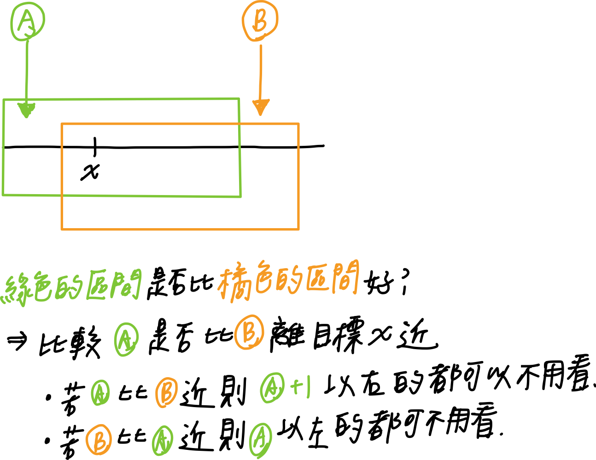

# 0658. Find K Closest Elements

* Difficulty: medium
* Link: https://leetcode.com/problems/find-k-closest-elements/
* Topics: Binary-Search
* highlight: 透過比較 m 與 m+k 得出以 m 開始的 window 與以 m + 1 開始的 window 誰比較近

# Clarification

1. Check the inputs and outputs
    - INPUT:
        - List[int] arr
        - int k (kth closest)
        - int x (target)
    - OUTPUT: List[int] array

# Naive Solution

### Thought Process

- 回傳的 array 為原 array 中的 subarray (長度為 k)
- 需去除 len(array) - k 的數字
- 去除順序會從兩頭開始去除 ⇒ 因為距離 x 最遠的一定在頭尾
- 每次比較頭尾的數字，將距離大的刪除
- Implement
    
    ```python
    class Solution:
        def findClosestElements(self, arr: List[int], k: int, x: int) -> List[int]:
            left = 0
            right = len(arr) - 1
            while right - left >= k:
                if abs(arr[right] - x) >= abs(arr[left] - x):
                    right -= 1
                else:
                    left += 1
            return arr[left:right + 1]
    ```
    

### Complexity

- Time complexity: O(n)
    - 每次都移動一個
- Space complexity: O(1)

### Problems & Improvement

- 每一回有沒有機會刪除掉一半?!

# Solution (Binary Search)

### Thought Process



1. 定義 left, right, middle
    
    
    
    - left = 0
    - right = n-k
    - m = (left + right) // 2
2. comparison
    - 比較以 m 開始的 window vs 以 m + 1 開始的 window 誰比較近
        - 透過比較 m 和 m + k 誰離 x 比較近
        
        
        
    - (x-m) vs (m+k-x) 看誰比較小
        
        
        
3. update
    - (x-m) ≤ (m+k-x)
        - m 較近
        
        ⇒ right = m
        
        ⇒ 只須找從 m 以左作為開始的 window
        
    - (x-m) > (m+k-x)
        - m+k 較近
        
        ⇒ left = m + 1
        
        ⇒ 只須找從 m+1 以右作為開始的 window
        
- Implement
    
    ```python
    class Solution:
        def findClosestElements(self, arr: List[int], k: int, x: int) -> List[int]:
            left = 0
            right = len(arr) - k
            while left < right:
                mid = (left + right) // 2
                if (x - arr[mid]) <= (arr[mid + k] - x):
                    right = mid
                else:
                    left = mid + 1
            
            return arr[left:left + k]
    ```
    

### Complexity

- Time complexity: O(log(n-k))
- Space complexity: O(1)

# Note

- **[[LeetCode] 658. Find K Closest Elements 寻找K个最近元素](https://www.cnblogs.com/grandyang/p/7519466.html)**
- **[Find K Closest Elements - Leetcode 658 - Python](https://www.youtube.com/watch?v=o-YDQzHoaKM)**