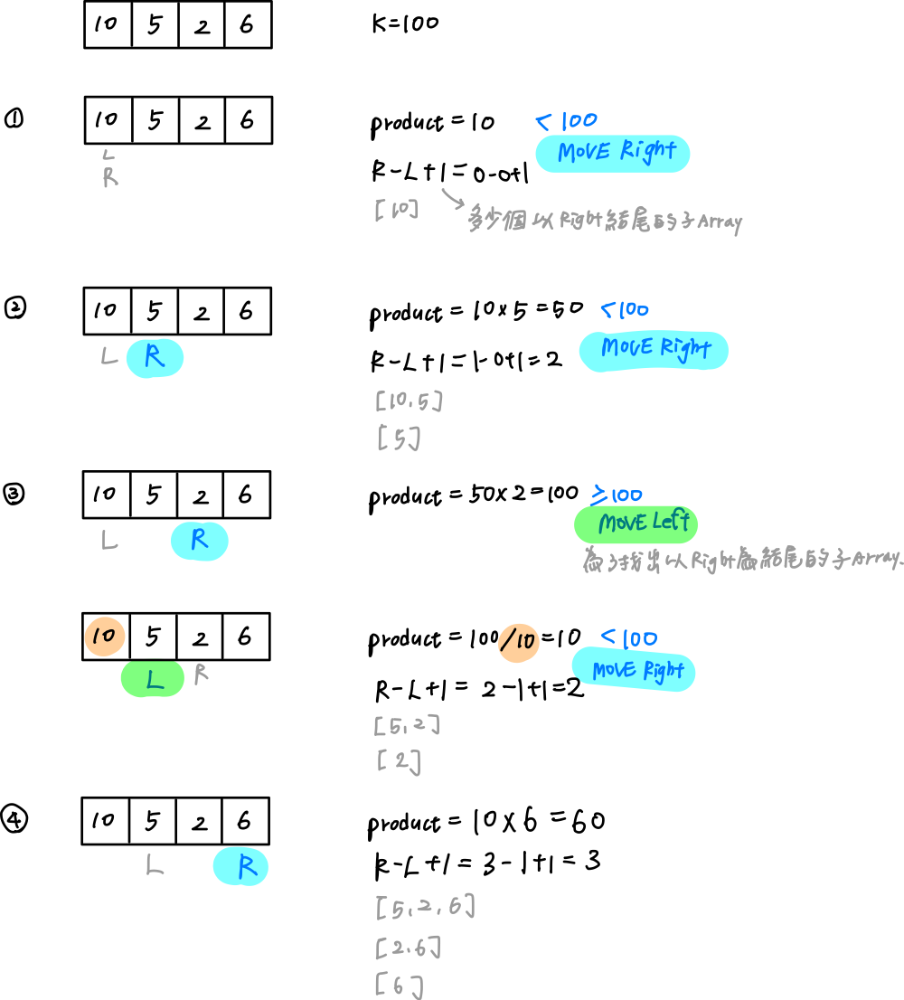

# 0713. Subarray Product Less Than K

* Difficulty: medium
* Link: https://leetcode.com/problems/subarray-product-less-than-k/
* Topics: Array-String

# Clarification

1. Check the inputs and outputs
    - INPUT: List[int]
    - OUTPUT: integer

# Naive Solution

### Thought Process

1. two pointer：start of the sub array、end of the sub array
2. start of the sub array (from 0 to len(nums) - 2)
3. end of the sub array (from start to len(nums) - 1)
4. if the product < target move the end pointer to right
5. if the product > target move the start pointer
- Implement
    
    ```python
    class Solution:
        def numSubarrayProductLessThanK(self, nums: List[int], k: int) -> int:
            """
            two pointers：start of the sub array、end of the sub array
              - start of the sub array (from 0 to len(nums) - 2)
              - end of the sub array (from start to len(nums) - 1)
            - if the product < target move the end pointer to right
            - if the product > target move the start pointer
            """
            count = 0
            for start in range(0, len(nums)):
                product = 1
                for end in range(start, len(nums)):
                    product *= nums[end]
                    if product < k:
                        count += 1
                    else:
                        break
            return count
    ```
    

### Complexity

- Time complexity:$O(n^2)$
- Space complexity:$O(1)$

### Problems & Improvement

- Time Limit Exceeded

# Improvement

### Thought Process

1. two pointer：start of the sub array、end of the sub array
    1. end of the sub array : from 0 to len(nums) - 1
    2. start of the sub array : from 0
2. if the product < target move the end pointer to right
3. if the product > target move the start pointer
4. count += (end - start + 1)
    
    [end - start + 1] ⇒ 多少個以 end 為結尾的子array
    
- Example explained
    
    
    
- Implement
    
    ```python
    class Solution:
        def numSubarrayProductLessThanK(self, nums: List[int], k: int) -> int:
            """
            two pointers：start of the sub array、end of the sub array
              - start of the sub array (from 0 to len(nums) - 2)
              - end of the sub array (from start to len(nums) - 1)
            - if the product < target move the end pointer to right
            - if the product > target move the start pointer
            """
            count = 0
            start = 0
            product = 1
            for end in range(len(nums)):
                product *= nums[end]
                while product >= k and start <= end:
                    product /= nums[start]
                    start += 1
                count += (end - start + 1)
            
            return count
    ```
    

### Complexity

- Time complexity:$O(n^2)$
- Space complexity:$O(1)$