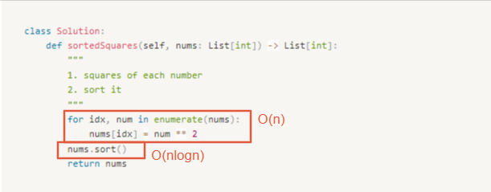

# 0977. Squares of a Sorted Array

* Difficulty: easy
* Link: https://leetcode.com/problems/squares-of-a-sorted-array/
* Topics: Array-String

# Clarification

1. Check the inputs and outputs
    - INPUT: List[int]
    - OUTPUT: List[int]

# Naive Solution

### Thought Process

1. squares of each number
2. sort it
- Implement
    
    ```python
    class Solution:
        def sortedSquares(self, nums: List[int]) -> List[int]:
            """
            1. squares of each number
            2. sort it
            """
            for idx, num in enumerate(nums):
                nums[idx] = num ** 2
            nums.sort()
            return nums
    ```
    

### Complexity

- Time complexity:$O(nlogn)$
    
    
    
- Space complexity:$O(1)$

### Problems & Improvement

- **Follow up:** Squaring each element and sorting the new array is very trivial, could you find an `O(n)` solution using a different approach?

# Improvement

### Thought Process

- `nums` is sorted in **non-decreasing** order.
1. split the array into two array
    1. negative array
    2. positive array
    
    ```python
    [-4,-1,0,3,10]
     ^^^^^ ^^^^^^
    ```
    
2. Reverse the negative array
3. begin to traverse two array
    1. square the num and check which element is larger, insert the larger one
- Implement
    
    ```python
    class Solution:
        def sortedSquares(self, nums: List[int]) -> List[int]:
            # split the array into two array (by linked list)
            positive = []
            negative = nums
            for idx, num in enumerate(nums):
                if num >= 0:
                    positive = nums[idx:]
                    negative = nums[:idx]
                    break
    
            # reverse the negative array
            negative = negative[::-1]
    
            # traverse the array
            result = []
            p, n = 0, 0
            while p < len(positive) and n < len(negative):
                if abs(negative[n]) < abs(positive[p]):
                    result.append(negative[n] ** 2)
                    n += 1
                else:
                    result.append(positive[p] ** 2)
                    p += 1
            for i in range(p, len(positive)):
                result.append(positive[i] ** 2)
            for i in range(n, len(negative)):
                result.append(negative[i] ** 2)
    
            return result
    ```
    

### Complexity

- Time complexity: $O(n)$
    
    
    
- Space complexity:$O(n)$

# Improvement

### Thought Process

- 可以不用 Reverse Array，因為 **non-decreasing** order，兩側最大，從兩側往內夾擊
- implement
    
    ```python
    class Solution:
        def sortedSquares(self, nums: List[int]) -> List[int]:
            # split the array into two array (by linked list)
            right = len(nums) - 1
            left = 0
            # traverse the array
            result = [0] * len(nums)
            resultIdx = len(nums) - 1
            while resultIdx >=0 :
                if abs(nums[left]) > abs(nums[right]):
                    result[resultIdx] = nums[left] ** 2
                    left += 1
                else:
                    result[resultIdx] = nums[right] ** 2
                    right -= 1
                resultIdx -=1
    
            return result
    ```
    

### Complexity

- Time complexity: $O(n)$
    
    
    
- Space complexity:$O(1)$

# Note

- **[Python: A comparison of lots of approaches! [Sorting, two pointers, deque, iterator, generator]](https://leetcode.com/problems/squares-of-a-sorted-array/discuss/310865/Python%3A-A-comparison-of-lots-of-approaches!-Sorting-two-pointers-deque-iterator-generator)**