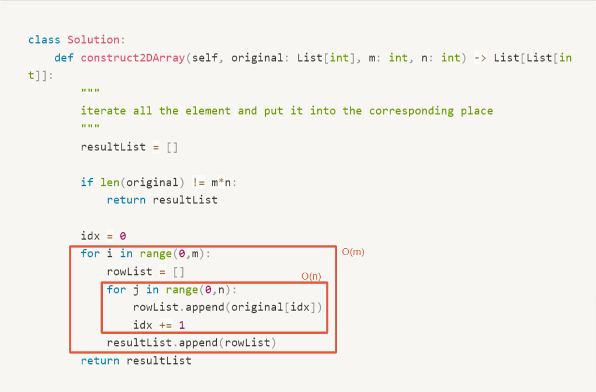

# 2022. Convert 1D Array Into 2D Array

- Difficulty: easy
- Link: https://leetcode.com/problems/convert-1d-array-into-2d-array/
- Topics: Array-String

# Clarification

1. Check the inputs and outputs
    - INPUT: List[int] , m, n
    - OUTPUT: List[list[int] with m rows and n columns
2. Check the main goal
    - 

# Naive Solution

### Thought Process

1. iterate all the element and put it into the corresponding place
    
    <aside>
    ⚠️ It is impossible to fit 2 elements in a 1x1 2D array, so return an empty 2D array.
    
    </aside>
    
    1. Need to check the number of the elements in the list and the target array
- Implement
    
    ```python
    class Solution:
        def construct2DArray(self, original: List[int], m: int, n: int) -> List[List[int]]:
            """
            iterate all the element and put it into the corresponding place
            """
            resultList = []
            
            if len(original) != m*n:
                return resultList
            
            idx = 0
            for i in range(0,m):
                rowList = []
                for j in range(0,n):
                    rowList.append(original[idx])
                    idx += 1
                resultList.append(rowList)
            return resultList
    ```
    

### Complexity

- Time complexity: $O(m*n)$
    
    
    
- Space complexity: $O(m*n)$

### Problems & Improvement

- python 於 list 有較快速的語法，從第 i 個元素到第 i+n個元素 [i:i+n]

# Improvement

### Thought Process

1. 直接以 index 作為 iterate 的對象，並且每次走 n 格
    
    ```python
    # 取 index i 到 index i + n 的 subarray
    original[i:i+n]
    ```
    
- Implement
    
    ```python
    class Solution:
        def construct2DArray(self, original: List[int], m: int, n: int) -> List[List[int]]:
            """
            iterate all the element and put it into the corresponding place
            """
            resultList = []
            if len(original) != m*n:
                return resultList
            for i in range(0, len(original), n):
                resultList.append(original[i:i+n])
            return resultList
    ```
    

### Complexity

- Time complexity: $O(m*n)$
    
    
    
- Space complexity: $O(m*n)$

# Check special cases, check error

- 需確認 m*n 與 original list 的長度

# Note